- [ ] Library and info updates
- [ ] change date
- [ ] update title
- [ ] Feature story
- [ ] Update  for images
- [ ] Update ICYDNCI
- [ ] All images 550w max only
- [ ] Link "View this email in your browser."

News Sources

- [Adafruit Playground](https://adafruit-playground.com/)
- Twitter: [CircuitPython](https://twitter.com/search?q=circuitpython&src=typed_query&f=live), [MicroPython](https://twitter.com/search?q=micropython&src=typed_query&f=live) and [Python](https://twitter.com/search?q=python&src=typed_query)
- [Raspberry Pi News](https://www.raspberrypi.com/news/)
- Mastodon [CircuitPython](https://octodon.social/tags/CircuitPython) and [MicroPython](https://octodon.social/tags/MicroPython)
- [hackster.io CircuitPython](https://www.hackster.io/search?q=circuitpython&i=projects&sort_by=most_recent) and [MicroPython](https://www.hackster.io/search?q=micropython&i=projects&sort_by=most_recent)
- YouTube: [CircuitPython](https://www.youtube.com/results?search_query=circuitpython&sp=CAI%253D), [MicroPython](https://www.youtube.com/results?search_query=micropython&sp=CAI%253D)
- Instructables: [CircuitPython](https://www.instructables.com/search/?q=circuitpython&projects=all&sort=Newest), [MicroPython](https://www.instructables.com/search/?q=micropython&projects=all&sort=Newest), [Raspberry Pi Python](https://www.instructables.com/search/?q=raspberry+pi+python&projects=all&sort=Newest)
- [hackaday CircuitPython](https://hackaday.com/blog/?s=circuitpython) and [MicroPython](https://hackaday.com/blog/?s=micropython)
- [python.org](https://www.python.org/)
- [Python Insider - dev team blog](https://pythoninsider.blogspot.com/)
- Individuals: [Jeff Geerling](https://www.jeffgeerling.com/blog), [Yakroo](https://x.com/Yakroo5077)
- Tom's Hardware: [CircuitPython](https://www.tomshardware.com/search?searchTerm=circuitpython&articleType=all&sortBy=publishedDate) and [MicroPython](https://www.tomshardware.com/search?searchTerm=micropython&articleType=all&sortBy=publishedDate) and [Raspberry Pi](https://www.tomshardware.com/search?searchTerm=raspberry%20pi&articleType=all&sortBy=publishedDate)
- [hackaday.io newest projects MicroPython](https://hackaday.io/projects?tag=micropython&sort=date) and [CircuitPython](https://hackaday.io/projects?tag=circuitpython&sort=date)
- [Google News Python](https://news.google.com/topics/CAAqIQgKIhtDQkFTRGdvSUwyMHZNRFY2TVY4U0FtVnVLQUFQAQ?hl=en-US&gl=US&ceid=US%3Aen)
- hackaday.io - [CircuitPython](https://hackaday.io/search?term=circuitpython) and [MicroPython](https://hackaday.io/search?term=micropython)

View this email in your browser. **Warning: Flashing Imagery**

Welcome to the latest Python on Microcontrollers newsletter! *insert 2-3 sentences from editor (what's in overview, banter)* - *Anne Barela, Editor*

We're on [Discord](https://discord.gg/HYqvREz), [Twitter](https://twitter.com/search?q=circuitpython&src=typed_query&f=live), and for past newsletters - [view them all here](https://www.adafruitdaily.com/category/circuitpython/). If you're reading this on the web, [subscribe here](https://www.adafruitdaily.com/). Here's the news this week:

## Why Beginning Developers Love Python

Recently, [Deb Nicholson](https://www.python.org/psf/records/staff/) of the [Python Software Foundation](https://www.python.org/psf-landing/), talked about the popularity of the language, the open source community and more in an episode of The New Stack Makers - [The New Stack](https://thenewstack.io/why-beginning-developers-love-python/l) and [YouTube](https://youtu.be/JK5i_FV1C3A?feature=shared).

> “It’s a great language for folks that want to learn how to code but aren’t sure what …  to do with it yet. And so you’re not as stuck as you are in some of the other languages that are more purpose-built for specific kinds of uses.”

## New Raspberry Pi Display and USB Hub

[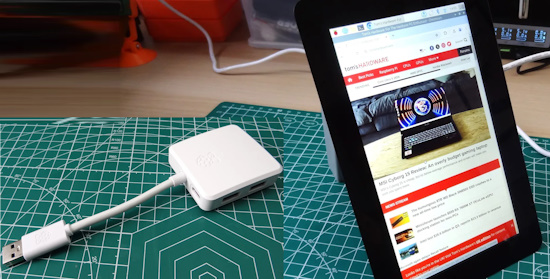](url)

Raspberry Pi has added two more products in the last week. The [Raspberry Pi Touch Display 2](https://www.raspberrypi.com/news/raspberry-pi-touch-display-2-on-sale-now-at-60/) replaces the original display introduced back in 2015 with a resolution increase to 1280x720 pixels. And the new [Raspberry Pi USB 3 Hub](https://www.raspberrypi.com/news/raspberry-pi-usb-3-hub-on-sale-now-at-12/) can help when lots of USB devices must be shared on Pi single board computers (SBC).

[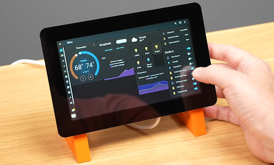](https://www.jeffgeerling.com/blog/2024/home-assistant-and-carplay-pi-touch-display-2)

Jeff Geerling provides an in-depth review and creates projects for Home Assistant and CarPlay with the Pi Touch Display 2 - [Jeff Geerling](https://www.jeffgeerling.com/blog/2024/home-assistant-and-carplay-pi-touch-display-2) and [YouTube](https://www.youtube.com/watch?v=gpyYCTgJO88). Via [X](https://x.com/geerlingguy/status/1854902803803545629).

## MicroPython in Orbit: Filip's Story of Satellite Innovation

Filip Rak, the team leader at the [Czech Aerospace Research Center](https://www.vzlu.cz/?lang=en) talks to Inspiring Computing about his journey from engineering to leading the development of attitude and orbit control systems for satellites, including the technical challenges and triumphs, like launching satellites and using MATLAB and MicroPython. Filip also shares how they took a selfie from space at their facility and how this achievement inspired future projects.

Catch the interview - [YouTube](https://www.youtube.com/watch?v=n2eVRbf5AHM) and more about the satellite and images [CARC](https://www.vzlu.cz/vzlusat-2-has-captured-new-image/?lang=en).

## A Pi Pico Powered Fallout T-45 Power Armor Helmet

Grimdaria on Reddit presents a nice Fallout T-45 Power Armor Helmet build. The shell is 3D printed and is powered by a Raspberry Pi Pico running MicroPython. Inside has a temperature sensor, temperature controlled fans, NeoPixels, stereo microphones and headphones, and an internal OLED status screen - [Reddit](https://www.reddit.com/r/raspberry_pi/comments/1gjgxi3/comment/lvzm2k3/).

## 5 Tips for Building a Home Server With a Single Board Computer

[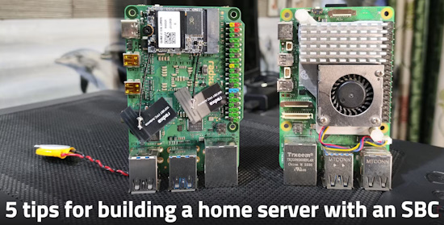](https://www.xda-developers.com/tips-for-building-a-home-server-with-an-sbc/)

With their affordable prices, low power consumption, and tiny form-factor, Single-Board Computers are amazing for lightweight DIY projects. SBCs can punch above their weight class when you want to dabble in containers and self-hosted apps. XDA five pointers for anyone looking to turn their credit-card-sized system into a reliable home server - [XDA](https://www.xda-developers.com/tips-for-building-a-home-server-with-an-sbc/).

## At the wire: Controlling a Raspberry Pi Pico W With BlueSky and MicroPython

[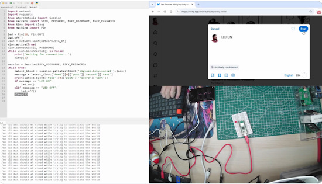](https://bsky.app/profile/biglesp.bsky.social/post/3lah7veegjr25)

[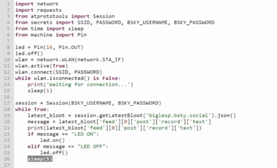](https://bsky.app/profile/biglesp.bsky.social/post/3lah7veegjr25)

A late entry for this issue: Les Pounder, working with Mike Bell, have demonstrated controlling a Raspberry Pi Pico W using messages from BlueSky. The demo shows an LED, but anything is possible with a few MicroPython code tweaks. - [BlueSky](https://bsky.app/profile/biglesp.bsky.social/post/3lah7veegjr25).

## Tips and Tricks for Clean, Readable Python Code

From decorators to list comprehensions, several built-in Python features help developers transform clunky code into clean, readable solutions without reinventing the wheel - [The New Stack](https://thenewstack.io/tips-and-tricks-for-clean-readable-python-code/).

## This Week's Python Streams

Python on Hardware is all about building a cooperative ecosphere which allows contributions to be valued and to grow knowledge. Below are the streams within the last week focusing on the community.

**CircuitPython Deep Dive Stream**

[Last Friday](https://youtube.com/live/zk1GddnUOJ4), Tim streamed work on Displayio Text Box.

You can see the latest video and past videos on the Adafruit YouTube channel under the Deep Dive playlist - [YouTube](https://www.youtube.com/playlist?list=PLjF7R1fz_OOXBHlu9msoXq2jQN4JpCk8A).

**CircuitPython Parsec**

John Park’s CircuitPython Parsec this week is on the Circle Drawing Tool - [Adafruit Blog](https://blog.adafruit.com/2024/11/08/john-parks-circuitpython-parsec-circle-drawing-tool-adafruit-circuitpython/) and [YouTube](https://youtu.be/ob2PwQj9nNI).

Catch all the episodes in the [YouTube playlist](https://www.youtube.com/playlist?list=PLjF7R1fz_OOWFqZfqW9jlvQSIUmwn9lWr).

**CircuitPython Weekly Meeting**

CircuitPython Weekly Meeting for November 4th ([notes](https://github.com/adafruit/adafruit-circuitpython-weekly-meeting/blob/main/2024/2024-11-04.md)) [on YouTube](https://youtu.be/8hA2PBzK7yM).

## Project of the Week: A New Python Calculator

[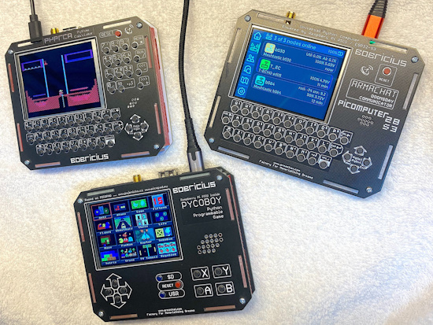](https://x.com/bobricius/status/1853881797223809095?t=R5sMDCKNMotk6Jg0VDe6DQ&s=03)

Peter Misenko writes that the pyprca Python calculator is back with same dimensions as his PICOmputer and the new pycoboy (a picopad clone). All of the devices can do Armachat, CircuitPython, Picomputer S3 new Meshtastic UI and emulate a ZX Spectrum, C64, and Atari800 - [X](https://x.com/bobricius/status/1853881797223809095?t=R5sMDCKNMotk6Jg0VDe6DQ&s=03) and [PeMi Technology](http://pemi.technology/).

## Popular Last Week

[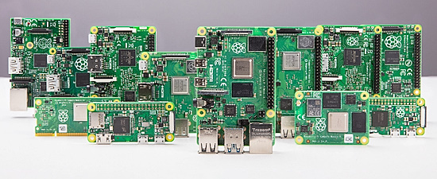](https://www.raspberrypi.com/news/raspberry-pi-product-series-explained/)

What was the most popular, most clicked link, in [last week's newsletter](https://www.adafruitdaily.com/2024/11/04/python-on-microcontrollers-newsletter-micropython-v1-24-0-is-here-a-halloween-wrap-up-and-much-more-circuitpython-python-micropython-thepsf-raspberry_pi/)? [Raspberry Pi product series explained](https://www.raspberrypi.com/news/raspberry-pi-product-series-explained/).

Did you know you can read past issues of this newsletter in the Adafruit Daily Archive? [Check it out](https://www.adafruitdaily.com/category/circuitpython/).

## Adafruit Playground

[Adafruit Playground](https://adafruit-playground.com/) is a new place for the community to post their projects and other making tips/tricks/techniques. Ad-free, it's an easy way to publish your work in a safe space for free.

## News From Around the Web

[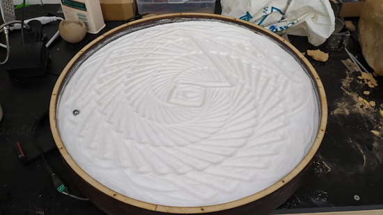](https://www.youtube.com/watch?v=VRa3OcBj4pM)

A sand painting drawing robot using an ESP32 and MicroPython - [GitHub](https://www.youtube.com/watch?v=VRa3OcBj4pM) and [YouTube](https://www.youtube.com/watch?v=VRa3OcBj4pM).

[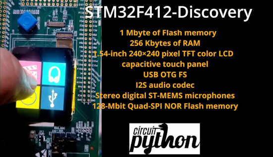](https://youtu.be/Yh-et4rcok8?feature=shared)

An introduction to the STM32F412 Discovery Kit and getting started with CircuitPython - [YouTube](https://youtu.be/Yh-et4rcok8?feature=shared).

[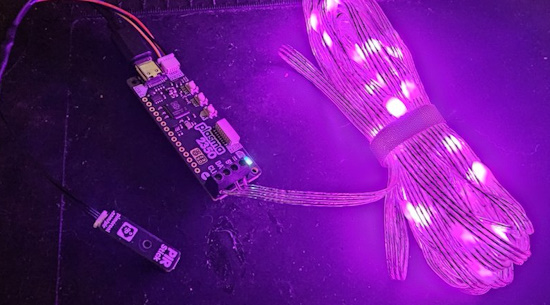](https://x.com/MrGlennJones/status/1853822622795964875)

A MicroPython script for the Pimoroni Plasma 2350/2040 which detects motion with the Pimoroni tinyfx PIR sensor connected to the Qwiic port then fades in a connected LED string. It also waits for a few seconds of no motion detection, then gently fades out the LED strip - [GitHub](https://github.com/mrglennjones/plasma2350-tinyfx-pir-fade-in-fade-out/tree/main). Via [X](https://x.com/MrGlennJones/status/1853822622795964875).

Testing out a custom Arcade Machine emulator with a custom joystick and buttons using CircuitPython - [X](https://x.com/kevsmac/status/1853225370830483923) and [YouTube](https://www.youtube.com/shorts/KkN-NFa3KI0).

[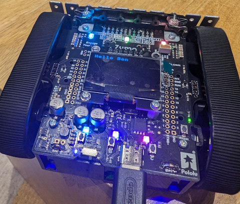](https://agileabstractions.com/micropython/)

Adventures with MicroPython and robotics - [Agile Abstractions](https://agileabstractions.com/micropython/).

6 tips for securely adding IoT devices to your home network - [XDA](https://www.xda-developers.com/tips-securely-adding-iot-devices-home-network/).

[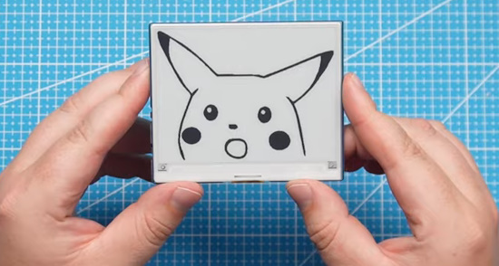](https://www.youtube.com/watch?v=RGil4N-uiQw)

A Raspberry Pi Pico and an e-paper display with MicroPython - [YouTube](https://www.youtube.com/watch?v=RGil4N-uiQw) and [Project Page](https://nerdcave.xyz/docs/pico-products-review/e-ink-display/).

ESP32 Neopixel LED art coded in Micropython from a handwritten note uploaded to Gemini AI - [YouTube](https://www.youtube.com/shorts/vKjRilh_ZJw).

[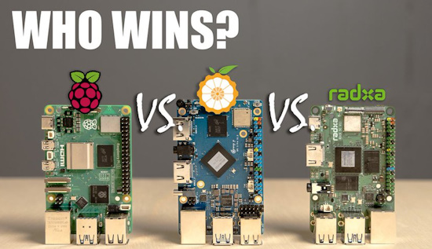](https://www.youtube.com/watch?v=2OQ5ascBuCw)

Pi 5 Battle: Raspberry Pi vs Orange Pi vs Radxa - [YouTube](https://www.youtube.com/watch?v=2OQ5ascBuCw).

[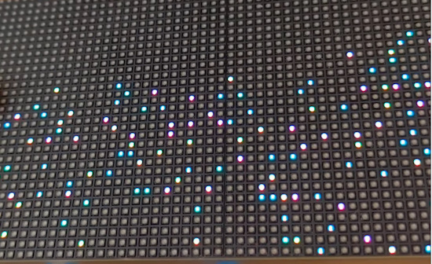](https://www.youtube.com/shorts/HQtL8ul2HuE)

RGB pixel sand using a Raspberry Pi Pico and MPU6050 gyro sensor with CircuitPython - [YouTube](https://www.youtube.com/shorts/HQtL8ul2HuE).

[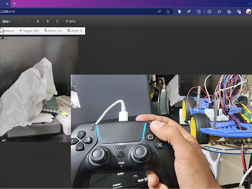](https://www.hackster.io/MohammadReza_Sharifi/control-raspberry-pi-pico-w-robot-using-ps5-controller-cf394e)

Control a Raspberry Pi Pico W robot using a PS5 controller with MicroPython - [hackster.io](https://www.hackster.io/MohammadReza_Sharifi/control-raspberry-pi-pico-w-robot-using-ps5-controller-cf394e).

text - [site](url).

text - [site](url).

text - [site](url).

[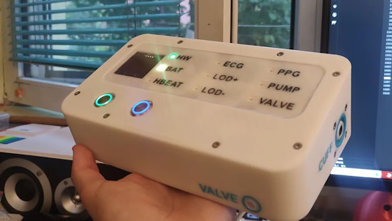](https://www.tomshardware.com/raspberry-pi/raspberry-pi-pico-w-drives-custom-cardiography-signal-measuring-device)

A Raspberry Pi Pico W drives custom cardiography signal-measuring device with Arduino firmware and Python data analysis - [Tom's Hardware](https://www.tomshardware.com/raspberry-pi/raspberry-pi-pico-w-drives-custom-cardiography-signal-measuring-device) and [GitHub](https://github.com/MilosRasic98/OpenCardiographySignalMeasuringDevice).

[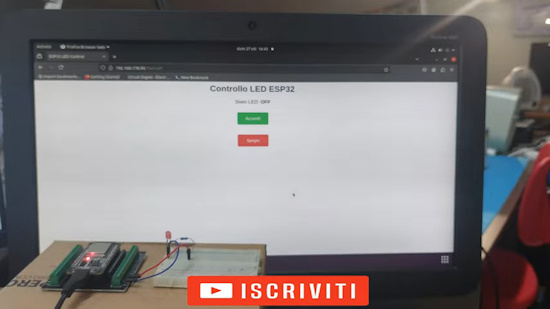](https://www.youtube.com/watch?v=yJ95XfzQdEo)

ESP32 Web Server – Controllo LED con Thonny e MicroPython - [YouTube](https://www.youtube.com/watch?v=yJ95XfzQdEo) and [code](https://docs.google.com/document/d/1MyTvwCTqZqjpOVi7Wc4RcsI8WIjwp1d0A6h_sW_64NM/edit?tab=t.0).

[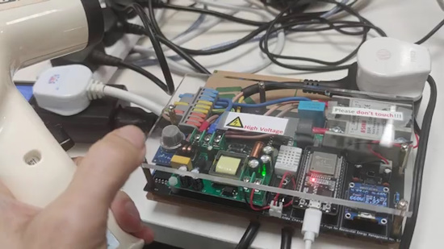](https://www.youtube.com/watch?v=G9abe4Yd19I)

A Smart Power Plug demo using MicroPython on an ESP32 - [YouTube](https://www.youtube.com/watch?v=G9abe4Yd19I).

Malicious Python package collects AWS credentials via 37,000 downloads - [SC Media](https://www.scworld.com/news/malicious-python-package-collects-aws-credentials-via-37000-downloads).

text - [site](url).

## New

[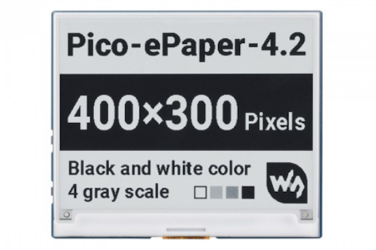](https://www.waveshare.com/pico-epaper-4.2.htm)

Waveshare has a 4.2 inch E-Paper/E-Ink display module specifically for Raspberry Pi Pico. 400×300px resolution, Black/White, 4 color grayscale, SPI communications - [Waveshare](https://www.waveshare.com/pico-epaper-4.2.htm) and [Review](https://nerdcave.xyz/docs/pico-products-review/e-ink-display/).

text - [site](url).

## New Boards Supported by CircuitPython

The number of supported microcontrollers and Single Board Computers (SBC) grows every week. This section outlines which boards have been included in CircuitPython or added to [CircuitPython.org](https://circuitpython.org/).

This week there were (#/no) new boards added:

- [Board name](url)
- [Board name](url)
- [Board name](url)

*Note: For non-Adafruit boards, please use the support forums of the board manufacturer for assistance, as Adafruit does not have the hardware to assist in troubleshooting.*

Looking to add a new board to CircuitPython? It's highly encouraged! Adafruit has four guides to help you do so:

- [How to Add a New Board to CircuitPython](https://learn.adafruit.com/how-to-add-a-new-board-to-circuitpython/overview)
- [How to add a New Board to the circuitpython.org website](https://learn.adafruit.com/how-to-add-a-new-board-to-the-circuitpython-org-website)
- [Adding a Single Board Computer to PlatformDetect for Blinka](https://learn.adafruit.com/adding-a-single-board-computer-to-platformdetect-for-blinka)
- [Adding a Single Board Computer to Blinka](https://learn.adafruit.com/adding-a-single-board-computer-to-blinka)

## New Learn Guides

[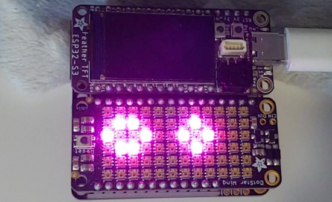](https://learn.adafruit.com/guides/latest)

The Adafruit Learning System has over 3,000 free guides for learning skills and building projects including using Python.

[Creating Custom LED Animations](https://learn.adafruit.com/creating-custom-led-animations) from [Tim C](https://learn.adafruit.com/u/Foamyguy)

## CircuitPython Libraries

The CircuitPython library numbers are continually increasing, while existing ones continue to be updated. Here we provide library numbers and updates!

To get the latest Adafruit libraries, download the [Adafruit CircuitPython Library Bundle](https://circuitpython.org/libraries). To get the latest community contributed libraries, download the [CircuitPython Community Bundle](https://circuitpython.org/libraries).

If you'd like to contribute to the CircuitPython project on the Python side of things, the libraries are a great place to start. Check out the [CircuitPython.org Contributing page](https://circuitpython.org/contributing). If you're interested in reviewing, check out Open Pull Requests. If you'd like to contribute code or documentation, check out Open Issues. We have a guide on [contributing to CircuitPython with Git and GitHub](https://learn.adafruit.com/contribute-to-circuitpython-with-git-and-github), and you can find us in the #help-with-circuitpython and #circuitpython-dev channels on the [Adafruit Discord](https://adafru.it/discord).

You can check out this [list of all the Adafruit CircuitPython libraries and drivers available](https://github.com/adafruit/Adafruit_CircuitPython_Bundle/blob/master/circuitpython_library_list.md). 

The current number of CircuitPython libraries is **###**!

**New Libraries**

Here's this week's new CircuitPython libraries:

* [library](url)

**Updated Libraries**

Here's this week's updated CircuitPython libraries:

* [library](url)

**Library PyPI Weekly Download Stats**

## What’s the CircuitPython team up to this week?

What is the team up to this week? Let’s check in:

**Dan**

I've been working on CircuitMatter, getting it to run on CircuitPython instead of CPython (regular Python). I have a small sample program, which acts as an "OnOff" device, such as a light bulb. I simply try to run it and, see what errors I get, and then fix them. After some simple fixes, I am now running into missing cryptography libraries that are not available in CircuitPython. I will find code I can use for them or implement them, as needed.

**Tim**

I finished up the Custom LED Animations guide and it was published this week. I worked on modifications inside of Adabot to remove the pypi installs from our weekly meeting stats, and to add counts for the Adafruit and Community bundles. I've also been going through open issues in CircuitPython libraries cleaning up where applicable and trying to resolve any that are within my means without being a huge time sink. 

I've added timeouts to some sensor drivers that could block forever, and improved documentation in a few, based on info from the issues. Lastly I updated the drivers.rst file in the library bundle to include the import names for each module in addition to their title counterparts. 

**Jeff**

I've been working on smaller items, like a check at build time for a known good GCC version.

**Liz**

This week I worked on the [NFC Raspberry Pi Media Player project](https://learn.adafruit.com/nfc-raspberry-pi-media-player). This project was fairly complicated because it not only involved writing code but also configuring the file system to use the M.2 HAT+ with an NVME drive. There is a lot of scattered documentation on this, mainly in Raspberry Pi forum posts with people reporting difficulties, so I'm glad I was able to document it in a guide to hopefully save people time and frustration. 

On the Python side of things, I really like the script I wrote to have a bouncing Blinka splash screen while waiting for an NFC card and the script for adding a new card and movie to the CSV file.

## Upcoming Events

PyCon AU will be held from the 22nd to the 26th of November at the Melbourne Convention and Exhibition Centre (MCEC) in Narrm/Melbourne. Matt Trentini and Damien George will both be presenting on MicroPython - [PyCon AU](https://2024.pycon.org.au/).

The next MicroPython Meetup in Melbourne will be on November 27th – [Meetup](https://www.meetup.com/micropython-meetup/events). You can see recordings of previous meetings on [YouTube](https://www.youtube.com/@MicroPythonOfficial). September's meeting notes are [here](https://melbournemicropythonmeetup.github.io/September-2024-Meetup/).

PyLadies Conference (PyLadiesCon) is a transformative event designed to promote diversity, learning, and empowerment within the Python community. December 6-8, 2024 online - [PyLadies](https://conference.pyladies.com/).

**Send Your Events In**

If you know of virtual events or upcoming events, please let us know via email to cpnews(at)adafruit(dot)com.

## Latest Releases

CircuitPython's stable release is [#.#.#](https://github.com/adafruit/circuitpython/releases/latest) and its unstable release is [#.#.#-##.#](https://github.com/adafruit/circuitpython/releases). New to CircuitPython? Start with our [Welcome to CircuitPython Guide](https://learn.adafruit.com/welcome-to-circuitpython).

[2024####](https://github.com/adafruit/Adafruit_CircuitPython_Bundle/releases/latest) is the latest Adafruit CircuitPython library bundle.

[2024####](https://github.com/adafruit/CircuitPython_Community_Bundle/releases/latest) is the latest CircuitPython Community library bundle.

[v#.#.#](https://micropython.org/download) is the latest MicroPython release. Documentation for it is [here](http://docs.micropython.org/en/latest/pyboard/).

[#.#.#](https://www.python.org/downloads/) is the latest Python release. The latest pre-release version is [#.#.#](https://www.python.org/download/pre-releases/).

[#,### Stars](https://github.com/adafruit/circuitpython/stargazers) Like CircuitPython? [Star it on GitHub!](https://github.com/adafruit/circuitpython)

## Call for Help -- Translating CircuitPython is now easier than ever

[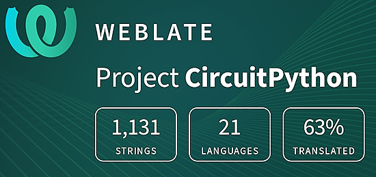](https://hosted.weblate.org/engage/circuitpython/)

One important feature of CircuitPython is translated control and error messages. With the help of fellow open source project [Weblate](https://weblate.org/), we're making it even easier to add or improve translations. 

Sign in with an existing account such as GitHub, Google or Facebook and start contributing through a simple web interface. No forks or pull requests needed! As always, if you run into trouble join us on [Discord](https://adafru.it/discord), we're here to help.

## NUMBER Thanks

The Adafruit Discord community, where we do all our CircuitPython development in the open, reached over NUMBER humans - thank you! Adafruit believes Discord offers a unique way for Python on hardware folks to connect. Join today at [https://adafru.it/discord](https://adafru.it/discord).

## ICYMI - In case you missed it

Python on hardware is the Adafruit Python video-newsletter-podcast! The news comes from the Python community, Discord, Adafruit communities and more and is broadcast on ASK an ENGINEER Wednesdays. The complete Python on Hardware weekly videocast [playlist is here](https://www.youtube.com/playlist?list=PLjF7R1fz_OOXRMjM7Sm0J2Xt6H81TdDev). The video podcast is on [iTunes](https://itunes.apple.com/us/podcast/python-on-hardware/id1451685192?mt=2), [YouTube](http://adafru.it/pohepisodes), [Instagram](https://www.instagram.com/adafruit/channel/)), and [XML](https://itunes.apple.com/us/podcast/python-on-hardware/id1451685192?mt=2).

[The weekly community chat on Adafruit Discord server CircuitPython channel - Audio / Podcast edition](https://itunes.apple.com/us/podcast/circuitpython-weekly-meeting/id1451685016) - Audio from the Discord chat space for CircuitPython, meetings are usually Mondays at 2pm ET, this is the audio version on [iTunes](https://itunes.apple.com/us/podcast/circuitpython-weekly-meeting/id1451685016), Pocket Casts, [Spotify](https://adafru.it/spotify), and [XML feed](https://adafruit-podcasts.s3.amazonaws.com/circuitpython_weekly_meeting/audio-podcast.xml).

## Contribute

The CircuitPython Weekly Newsletter is a CircuitPython community-run newsletter emailed every Monday. The complete [archives are here](https://www.adafruitdaily.com/category/circuitpython/). It highlights the latest CircuitPython related news from around the web including Python and MicroPython developments. To contribute, edit next week's draft [on GitHub](https://github.com/adafruit/circuitpython-weekly-newsletter/tree/gh-pages/_drafts) and [submit a pull request](https://help.github.com/articles/editing-files-in-your-repository/) with the changes. You may also tag your information on Twitter with #CircuitPython. 

Join the Adafruit [Discord](https://adafru.it/discord) or [post to the forum](https://forums.adafruit.com/viewforum.php?f=60) if you have questions.
