View this email in your browser.

Welcome to the latest Python on Microcontrollers newsletter! Thanks to everyone for reading last week's Pi-centric issue. This issue pivots  back to a mix of commmunity news with a new version of CircuitPython and work on new MicroPython versions. There is also a lot happening with standard Python at the moment, including PyCon US 2025 next year. Wishing US folks a Happy Thanksgiving this week. - *Anne Barela, Editor*

We're on [Discord](https://discord.gg/HYqvREz), [Twitter](https://twitter.com/search?q=circuitpython&src=typed_query&f=live), and for past newsletters - [view them all here](https://www.adafruitdaily.com/category/circuitpython/). If you're reading this on the web, [subscribe here](https://www.adafruitdaily.com/). Here's the news this week:

## CircuitPython 9.2.1 Released

CircuitPython 9.2.1 is the latest bugfix revision of CircuitPython and is a new stable release - [Adafruit Blog](https://blog.adafruit.com/2024/11/20/circuitpython-9-2-1-released/) and [Release Notes](https://github.com/adafruit/circuitpython/releases/tag/9.2.1).

**Highlights of this release**
* Additional `synthio` and `audiofilters` functionality.
* `I2CTarget` and `keys.*.reset()` fixes.
* RP2350: PSRAM and `cpu.temperature` fixes.
* `rp2pio`: add background read operation.
* Five new boards.

## Introduction to DMA

[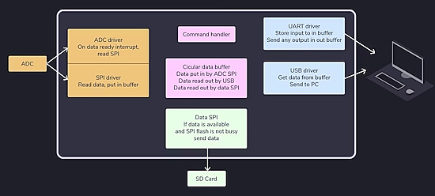](https://embedded-fm.cdn.ampproject.org/c/s/embedded.fm/blog/2024/10/30/introduction-to-dma?format=amp)

Elecia White provides insights into how DMA works and why it's used to make systems faster - [embedded.fm](https://embedded-fm.cdn.ampproject.org/c/s/embedded.fm/blog/2024/10/30/introduction-to-dma?format=amp).

## Does Your Raspberry Pi 5 Need an NVMe Drive?

[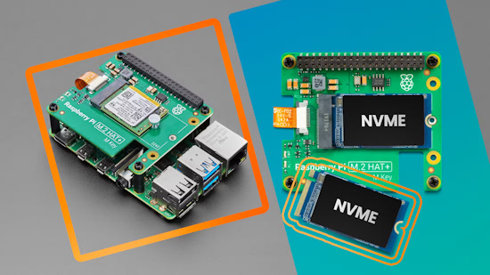](https://www.howtogeek.com/does-your-raspberry-pi-5-need-an-nvme-drive/)

The Raspberry Pi 5 has excellent features, including [PCIe support](https://www.adafruit.com/product/5902), which allows you to hook up a speedy [NVMe storage drive](https://www.adafruit.com/product/6090) for the first time. What does this mean? NVMes are fast, so you can bring great speed and reliability to your Pi 5. If you're tired of SD card storage limitations on your Pi 5, this article dives into when it's worth investing in an NVMe drive - [How-To Geek](https://www.howtogeek.com/does-your-raspberry-pi-5-need-an-nvme-drive/).

## Using Python with Virtual Environments

[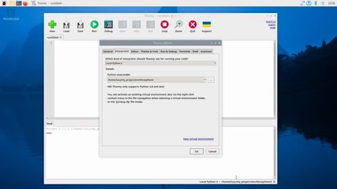](https://www.raspberrypi.com/news/using-python-with-virtual-environments-the-magpi-148/)

Raspberry Pi OS comes with Python 3 pre-installed. Changing the system Python installation can cause problems for the operating system. When you install third-party Python libraries, you can refer to this handy guide to use the correct package-management tools - [Raspberry Pi News](https://www.raspberrypi.com/news/using-python-with-virtual-environments-the-magpi-148/).

## Is Python Really That Slow?

[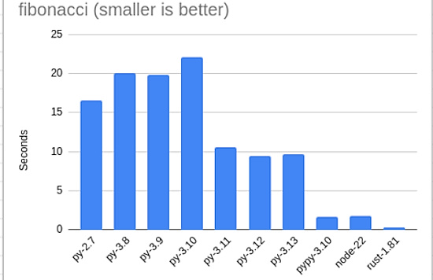](https://blog.miguelgrinberg.com/post/is-python-really-that-slow)

Miguel Grinberg has running some benchmarks to form a better mental image of Python's often criticized performance - [miguelgrinberg](https://blog.miguelgrinberg.com/post/is-python-really-that-slow).

## And the #1 CPython IDE (for big Python) is . . .

What's the best IDE for Python? Here's how InfoWorld rates IDLE, Komodo, PyCharm, PyDev, Microsoft's Python and Python Tools extensions for Visual Studio Code, and Spyder - [InfoWorld](https://www.infoworld.com/article/2250631/review-7-python-ides-compared.html).

## 5 Obscure Raspberry Pi Operating Systems That Deserve More Love

[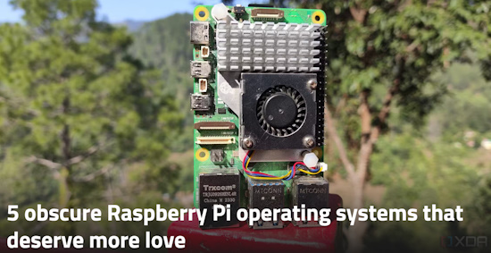](https://www.xda-developers.com/obscure-raspberry-pi-operating-systems/)

One of the biggest advantages of the Raspberry Pi boards lies in the fact that you can use inexpensive microSD cards to switch between different operating systems at will. Combine that with the massive number of Raspberry Pi distros, and you can easily convert your tiny SBC into your distro-hopping companion - [XDA](https://www.xda-developers.com/obscure-raspberry-pi-operating-systems/).

## New Release: The Official Raspberry Pi Camera Guide, 2nd Edition

[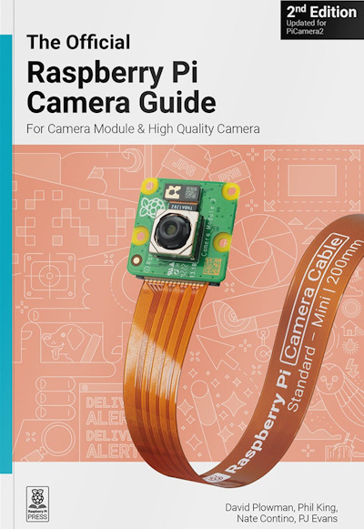](https://store.rpipress.cc/products/the-official-raspberry-pi-camera-guide-2nd-edition)

Add the power of HDR photography, Full HD video, and AI image recognition to your Raspberry Pi projects with Camera Modules.

This book is your step-by-step guide to adding a Camera Module to your Raspberry Pi board. You'll master still images, capture video clips as digital files, and control the camera with shell commands and Python code - [Raspberry Pi Press](https://store.rpipress.cc/products/the-official-raspberry-pi-camera-guide-2nd-edition).

## This Week's Python Streams

Python on Hardware is all about building a cooperative ecosphere which allows contributions to be valued and to grow knowledge. Below are the streams within the last week focusing on the community.

**CircuitPython Deep Dive Stream**

[Last Friday](https://youtube.com/live/5_5azbN5x0A), Tim streamed work on refactoring GitHub API requests in Adabot.

The [Friday before](https://youtube.com/live/f1ap7Z7eDs0), Tim streamed on Refactor & Cleanup TextBox.

You can see the latest video and past videos on the Adafruit YouTube channel under the Deep Dive playlist - [YouTube](https://www.youtube.com/playlist?list=PLjF7R1fz_OOXBHlu9msoXq2jQN4JpCk8A).

**CircuitPython Parsec**

John Park’s CircuitPython Parsec this week is on Touchscreen Triangles - [Adafruit Blog](https://blog.adafruit.com/2024/11/22/john-parks-circuitpython-parsec-touchscreen-triangles-adafruit-circuitpython/) and [YouTube](https://youtu.be/nYDBsc_aZVQ).

Catch all the episodes in the [YouTube playlist](https://www.youtube.com/playlist?list=PLjF7R1fz_OOWFqZfqW9jlvQSIUmwn9lWr).

**CircuitPython Weekly Meeting**

CircuitPython Weekly Meeting for November 18th ([notes](https://github.com/adafruit/adafruit-circuitpython-weekly-meeting/blob/main/2024/2024-11-18.md)) [on YouTube](https://www.youtube.com/watch?v=YOAXwbB-Wbo).

## Project of the Week - A TVA TemPad Prop Build

Matt Gray makes a Marvel TVA TemPad prop from Loki using an RP2040 board and Adafruit display, programmed in CircuitPython - [Adafruit Blog](https://blog.adafruit.com/2024/11/21/a-tva-tempad-prop-build-the-magpi-issue-147-themagpi/) and [The MagPi](https://magpi.raspberrypi.com/issues/147).

## Popular Last Week

[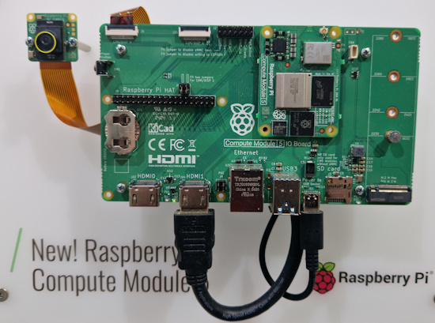](https://chaos.social/@kuro/113469240412312622)

What was the most popular, most clicked link, in [last week's newsletter](https://www.adafruitdaily.com/2024/11/18/python-on-microcontrollers-newsletter-raspberry-pi-special-issue-and-much-more-circuitpython-python-micropython-thepsf-raspberry_pi/)? [Raspberry Pi CM5 spotted in the wild at electronica24](https://chaos.social/@kuro/113469240412312622).

Did you know you can read past issues of this newsletter in the Adafruit Daily Archive? [Check it out](https://www.adafruitdaily.com/category/circuitpython/).

## New Notes from Adafruit Playground

[Adafruit Playground](https://adafruit-playground.com/) is a new place for the community to post their projects and other making tips/tricks/techniques. Ad-free, it's an easy way to publish your work in a safe space for free.

[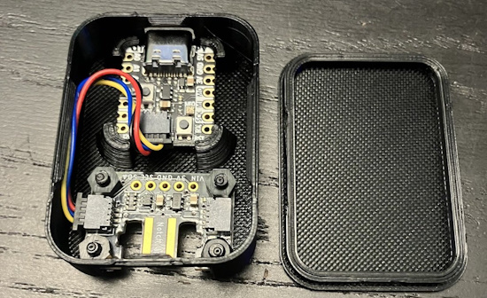](https://adafruit-playground.com/u/squid_jpg/pages/wii-nunchuck-usb-adapter)

Wii Nunchuck USB Adapter - [Adafruit Playground](https://adafruit-playground.com/u/squid_jpg/pages/wii-nunchuck-usb-adapter).

[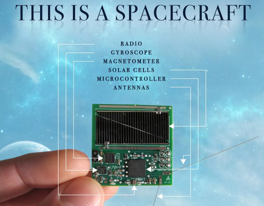](https://adafruit-playground.com/u/mrklingon/pages/do-you-want-to-make-a-starship)

Do You Want to Make a Starship? - [Adafruit Playground](https://adafruit-playground.com/u/mrklingon/pages/do-you-want-to-make-a-starship).

## News From Around the Web

[PyCon US 2025](https://us.pycon.org/2025/) is being held from May 14 - May 22, 2025 this year. The organizers are seeking proposals for talks and more. There are some new rules on proposal submission this year - [Proposals](https://pretalx.com/pyconus2025/).

Python 3.14.0 alpha 2 released - [Python Insider Blog](https://pythoninsider.blogspot.com/2024/11/python-3140-alpha-2-released.html).

Pibo: the bipedal robot based on Raspberry Pi and programmable in Python & more - [The MagPi](https://magpi.raspberrypi.com/articles/pibo-the-bipedal-robot-review).

[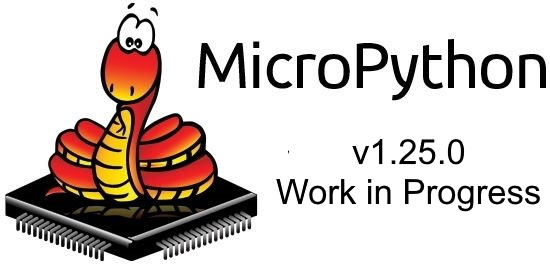](https://github.com/micropython/micropython/milestones)

Work on MicroPython v1.24.1 and v1.25.0 is in progress - [GitHub](https://github.com/micropython/micropython/milestones).

Bjorn is a Raspberry Pi-powered Tamagotchi-like network pen-testing tool using Raspberry Pi Zero W and Python - [GitHub](https://github.com/infinition/Bjorn). Via [Tom's Hardware](https://www.tomshardware.com/raspberry-pi/bjorn-is-a-raspberry-pi-powered-tamagotchi-like-network-pen-testing-tool).

[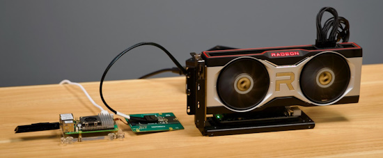](https://www.jeffgeerling.com/blog/2024/llms-accelerated-egpu-on-raspberry-pi-5)

LLMs accelerated with eGPU on a Raspberry Pi 5 - [Jeff Geerling](https://www.jeffgeerling.com/blog/2024/llms-accelerated-egpu-on-raspberry-pi-5).

Threading in Python: how to get the return value from a thread - [Medium](https://medium.com/the-code-canvas/threading-in-python-how-to-get-the-return-value-from-a-thread-95b28d5ec229).

Use a transparent OLED display with Raspberry Pi and Python - [Sozorablog](https://sozorablog.com/pi-transparent-oled/) (Japanese). Via [X](https://x.com/sozoraemon/status/1858470327912952202).

[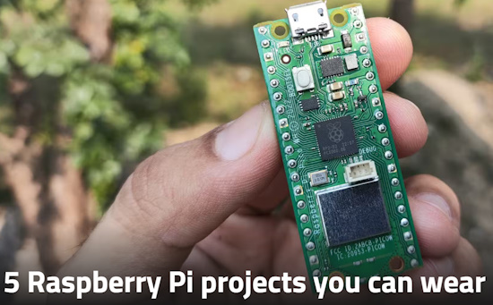](https://www.xda-developers.com/raspberry-pi-projects-wear/)

5 Raspberry Pi projects you can wear - [XDA](https://www.xda-developers.com/raspberry-pi-projects-wear/).

[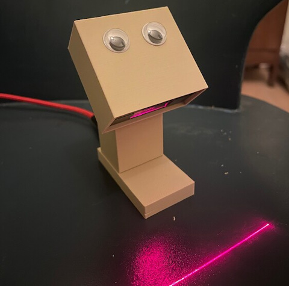](https://forum.revspace.nl/t/barcodebeestje-voor-muziek/465)

Barcode beast for music scans Compact Disk barcodes using a Raspberry Pi and Python - [Rev Space blog](https://forum.revspace.nl/t/barcodebeestje-voor-muziek/465).

[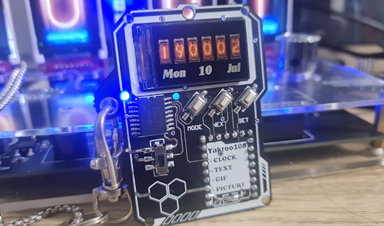](https://x.com/Yakroo5077/status/1857274718547857612?t=LJ78L9Mxk4NtHzYlD-Ho4w&s=03)

A neckwatch using MicroPython - [YouTube](https://www.youtube.com/watch?v=ME0TuOb_b2c), [hackster.io](https://www.hackster.io/yakroo/neck-watch-pico-cyberpunk-01860f), and [hackaday.io](https://hackaday.io/project/191631-neck-watch-pico-cyberpunk). Via [X](https://x.com/Yakroo5077/status/1857274718547857612?t=LJ78L9Mxk4NtHzYlD-Ho4w&s=03).

[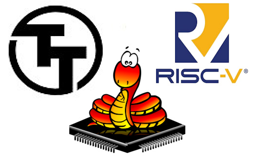](https://rebel-lion.uk/@mike/113518024660943678)

Mike Bell is looking to get MicroPython running on a [Tiny Tapeout](https://www.tinytapeout.com/) RISC-V processor - [Mastodon](https://rebel-lion.uk/@mike/113518024660943678) and [GitHub](https://github.com/urish/tinyQV/tree/main).

[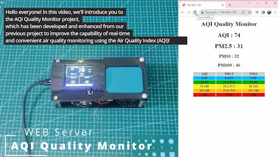](https://www.youtube.com/watch?v=8y3oFdj1qZg)

An AQI monitor PM2.5 v2.0 with a webserver using an RP2040 and CircuitPython - [YouTube](https://www.youtube.com/watch?v=8y3oFdj1qZg).

[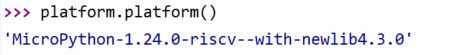](https://jhalfmoon.com/dbc/2024/11/22/pico%e4%b8%89%e6%98%a751-%e3%83%a9%e3%82%ba%e3%83%91%e3%82%a4pico2rp2350%e3%80%81micropython%e3%81%a7risc-v/)

Raspberry Pi Pico 2: RP2350, MicroPython and RISC-V - [jhalfmoon](https://jhalfmoon.com/dbc/2024/11/22/pico%e4%b8%89%e6%98%a751-%e3%83%a9%e3%82%ba%e3%83%91%e3%82%a4pico2rp2350%e3%80%81micropython%e3%81%a7risc-v/) (Japanese).

Building an automated fault detection system for production lines using Raspberry Pi, Python and machine learning - [Instructables](https://www.instructables.com/Building-an-Automated-Fault-Detection-System-for-P/).

Thomas E. Kurtz, a Creator of BASIC Computer Language, Dies at 96 - [New York Times](https://www.nytimes.com/2024/11/16/technology/thomas-kurtz-dead.html?unlocked_article_code=1.aU4.hF9G.IyyV5xUIrVlC&smid=url-share).

[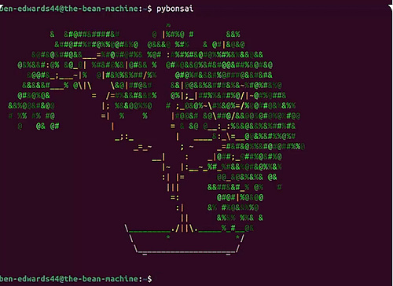](https://github.com/Ben-Edwards44/PyBonsai)

PyBonsai: Generate procedural ASCII art trees in the terminal - [GitHub](https://github.com/Ben-Edwards44/PyBonsai). Via [X](https://x.com/algoritmic/status/1858841000774430853).

Can you tell free Python art from multi-million dollar pieces? - [Towards Data Science](https://towardsdatascience.com/can-you-tell-free-python-art-from-multi-million-dollar-pieces-c292ec0747db).

How I Turned My Raspberry Pi Into a Private Internet Archive - [meketecheasier](https://www.maketecheasier.com/turn-raspberry-pi-into-private-internet-archive/).

## New

[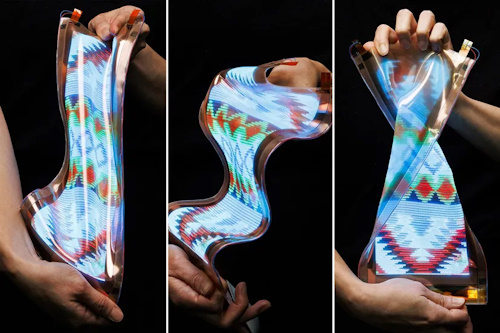](https://www.theverge.com/2024/11/12/24294480/lg-display-stretchable-screen-expands)

LG Display’s stretchable screen is now even stretchier. The latest prototype of the company’s resilient screen can stretch from 12 to 18 inches, perfect for wearables - [The Verge](https://www.theverge.com/2024/11/12/24294480/lg-display-stretchable-screen-expands).

> According to LG Display, it “can be repeatedly stretched over 10,000 times, maintaining clear image quality even in extreme environments such as exposure to low or high temperatures and external shocks.”

[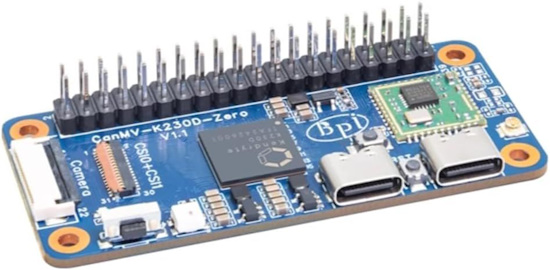](https://liliputing.com/this-tiny-banana-pi-board-is-like-a-risc-v-powered-raspberry-pi-zero/)

The [Banana Pi BPI-CanMV-K230D-Zero](https://docs.banana-pi.org/en/BPI-CanMV-K230D/BananaPi_BPI-CanMV-K230D-Zero) is like a RISC-V powered Raspberry Pi Zero - [Liliputing](https://liliputing.com/this-tiny-banana-pi-board-is-like-a-risc-v-powered-raspberry-pi-zero/).

## New Boards Supported by CircuitPython

The number of supported microcontrollers and Single Board Computers (SBC) grows every week. This section outlines which boards have been included in CircuitPython or added to [CircuitPython.org](https://circuitpython.org/).

This week there was one new board added:

- [Gemini](https://circuitpython.org/board/0xcb_gemini/)

*Note: For non-Adafruit boards, please use the support forums of the board manufacturer for assistance, as Adafruit does not have the hardware to assist in troubleshooting.*

Looking to add a new board to CircuitPython? It's highly encouraged! Adafruit has four guides to help you do so:

- [How to Add a New Board to CircuitPython](https://learn.adafruit.com/how-to-add-a-new-board-to-circuitpython/overview)
- [How to add a New Board to the circuitpython.org website](https://learn.adafruit.com/how-to-add-a-new-board-to-the-circuitpython-org-website)
- [Adding a Single Board Computer to PlatformDetect for Blinka](https://learn.adafruit.com/adding-a-single-board-computer-to-platformdetect-for-blinka)
- [Adding a Single Board Computer to Blinka](https://learn.adafruit.com/adding-a-single-board-computer-to-blinka)

## CircuitPython Libraries

The CircuitPython library numbers are continually increasing, while existing ones continue to be updated. Here we provide library numbers and updates!

To get the latest Adafruit libraries, download the [Adafruit CircuitPython Library Bundle](https://circuitpython.org/libraries). To get the latest community contributed libraries, download the [CircuitPython Community Bundle](https://circuitpython.org/libraries).

If you'd like to contribute to the CircuitPython project on the Python side of things, the libraries are a great place to start. Check out the [CircuitPython.org Contributing page](https://circuitpython.org/contributing). If you're interested in reviewing, check out Open Pull Requests. If you'd like to contribute code or documentation, check out Open Issues. We have a guide on [contributing to CircuitPython with Git and GitHub](https://learn.adafruit.com/contribute-to-circuitpython-with-git-and-github), and you can find us in the #help-with-circuitpython and #circuitpython-dev channels on the [Adafruit Discord](https://adafru.it/discord).

You can check out this [list of all the Adafruit CircuitPython libraries and drivers available](https://github.com/adafruit/Adafruit_CircuitPython_Bundle/blob/master/circuitpython_library_list.md). 

The current number of CircuitPython libraries is **506**!

**Updated Libraries**

Here's this week's updated CircuitPython libraries:

  * [adafruit/Adafruit_CircuitPython_DisplayIO_Layout](https://github.com/adafruit/Adafruit_CircuitPython_DisplayIO_Layout)
  * [adafruit/Adafruit_CircuitPython_EMC2101](https://github.com/adafruit/Adafruit_CircuitPython_EMC2101)
  * [adafruit/Adafruit_CircuitPython_Display_Text](https://github.com/adafruit/Adafruit_CircuitPython_Display_Text)
  * [adafruit/Adafruit_CircuitPython_Fingerprint](https://github.com/adafruit/Adafruit_CircuitPython_Fingerprint)

## What’s the CircuitPython team up to this week?

What is the team up to this week? Let’s check in:

**Dan**

I released CircuitPython 9.2.1 which has bug fixes, some new audio features, and adds several new boards.

I'm continuing to work on cryptography to get CircuitMatter to run on CircuitPython.

**Tim**

I am continuing to work on issues across the CircuitPython libraries and resolved a handful more this week. One that I'm particularly stoked about is a new `FilledPolygon` for the `Display_Shapes`, as well as support for setting the outline stroke size for both it and the pre-existing `Polygon` classes. 

I also added some logic to the circuitpython.org search function to give higher precedent to devices with tags that match search terms exactly. This resolves an issue that caused the Pico 2 device to be somewhat far down the page if you searched "Pico 2". Today I've started on a new project to fetch posts from Bluesky and show them on a display.

**Jeff**

This past week, I added a board definition for the upcoming Raspberry Pi Pico 2 W, with the RP2350 MCU and a WiFi coprocessor.

**Liz**

This week I worked on documenting the Feather RP2350 Video Synth. This project runs CircuitPython code that takes audio input with a PDM mic for FFT that affect the three animations that are output via HSTX to DVI from the Feather. Initially I was hoping to use the quad seesaw rotary encoder board for controlling the animations, but they were not as responsive as I wanted them to be. Instead, I brought in three analog potentiometers for control and a single seesaw rotary encoder to change modes. This project will be documented soon on the Learn system.

## Upcoming Events

PyCon AU is now on, from 22nd to the 26th of November at the Melbourne Convention and Exhibition Centre (MCEC) in Narrm/Melbourne. Matt Trentini and Damien George will both be presenting on MicroPython - [PyCon AU](https://2024.pycon.org.au/).

The next MicroPython Meetup in Melbourne will be on November 27th – [Meetup](https://www.meetup.com/micropython-meetup/events). You can see recordings of previous meetings on [YouTube](https://www.youtube.com/@MicroPythonOfficial). September's meeting notes are [here](https://melbournemicropythonmeetup.github.io/September-2024-Meetup/).

PyLadies Conference (PyLadiesCon) is a transformative event designed to promote diversity, learning, and empowerment within the Python community. December 6-8, 2024 online - [PyLadies](https://conference.pyladies.com/).

The community is coming back to Pittsburgh, Pennsylvania for PyCon US 2025 May 14 - May 22, 2025 - [us.pycon.org](https://us.pycon.org/2025/).

**Send Your Events In**

If you know of virtual events or upcoming events, please let us know via email to cpnews(at)adafruit(dot)com.

## Latest Releases

CircuitPython's stable release is [9.2.1](https://github.com/adafruit/circuitpython/releases/latest). New to CircuitPython? Start with our [Welcome to CircuitPython Guide](https://learn.adafruit.com/welcome-to-circuitpython).

[20241121](https://github.com/adafruit/Adafruit_CircuitPython_Bundle/releases/latest) is the latest Adafruit CircuitPython library bundle.

[20241110](https://github.com/adafruit/CircuitPython_Community_Bundle/releases/latest) is the latest CircuitPython Community library bundle.

[v1.24.0](https://micropython.org/download) is the latest MicroPython release. Documentation for it is [here](http://docs.micropython.org/en/latest/pyboard/).

[3.13.0](https://www.python.org/downloads/) is the latest Python release. The latest pre-release version is [3.13.0a2](https://www.python.org/download/pre-releases/).

[4,117 Stars](https://github.com/adafruit/circuitpython/stargazers) Like CircuitPython? [Star it on GitHub!](https://github.com/adafruit/circuitpython)

## Call for Help -- Translating CircuitPython is now easier than ever

[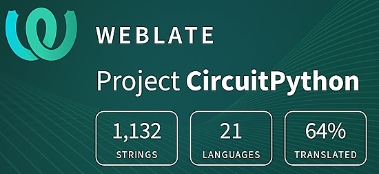](https://hosted.weblate.org/engage/circuitpython/)

One important feature of CircuitPython is translated control and error messages. With the help of fellow open source project [Weblate](https://weblate.org/), we're making it even easier to add or improve translations. 

Sign in with an existing account such as GitHub, Google or Facebook and start contributing through a simple web interface. No forks or pull requests needed! As always, if you run into trouble join us on [Discord](https://adafru.it/discord), we're here to help.

## 38,485 Thanks

The Adafruit Discord community, where we do all our CircuitPython development in the open, reached over 38,485 humans - thank you! Adafruit believes Discord offers a unique way for Python on hardware folks to connect. Join today at [https://adafru.it/discord](https://adafru.it/discord).

## ICYMI - In case you missed it

Python on hardware is the Adafruit Python video-newsletter-podcast! The news comes from the Python community, Discord, Adafruit communities and more and is broadcast on ASK an ENGINEER Wednesdays. The complete Python on Hardware weekly videocast [playlist is here](https://www.youtube.com/playlist?list=PLjF7R1fz_OOXRMjM7Sm0J2Xt6H81TdDev). The video podcast is on [iTunes](https://itunes.apple.com/us/podcast/python-on-hardware/id1451685192?mt=2), [YouTube](http://adafru.it/pohepisodes), [Instagram](https://www.instagram.com/adafruit/channel/)), and [XML](https://itunes.apple.com/us/podcast/python-on-hardware/id1451685192?mt=2).

[The weekly community chat on Adafruit Discord server CircuitPython channel - Audio / Podcast edition](https://itunes.apple.com/us/podcast/circuitpython-weekly-meeting/id1451685016) - Audio from the Discord chat space for CircuitPython, meetings are usually Mondays at 2pm ET, this is the audio version on [iTunes](https://itunes.apple.com/us/podcast/circuitpython-weekly-meeting/id1451685016), Pocket Casts, [Spotify](https://adafru.it/spotify), and [XML feed](https://adafruit-podcasts.s3.amazonaws.com/circuitpython_weekly_meeting/audio-podcast.xml).

## Contribute

The CircuitPython Weekly Newsletter is a CircuitPython community-run newsletter emailed every Monday. The complete [archives are here](https://www.adafruitdaily.com/category/circuitpython/). It highlights the latest CircuitPython related news from around the web including Python and MicroPython developments. To contribute, edit next week's draft [on GitHub](https://github.com/adafruit/circuitpython-weekly-newsletter/tree/gh-pages/_drafts) and [submit a pull request](https://help.github.com/articles/editing-files-in-your-repository/) with the changes. You may also tag your information on Twitter with #CircuitPython. 

Join the Adafruit [Discord](https://adafru.it/discord) or [post to the forum](https://forums.adafruit.com/viewforum.php?f=60) if you have questions.
