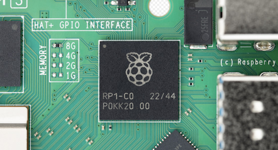
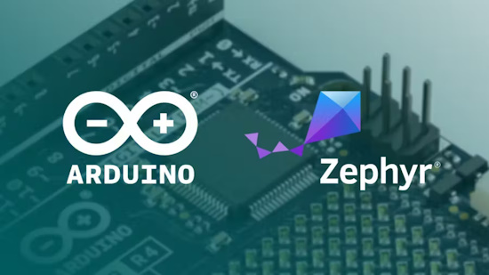
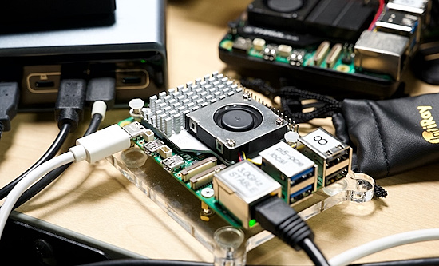
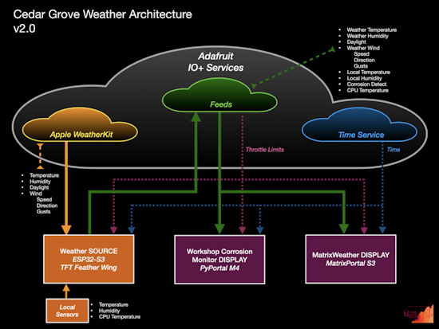
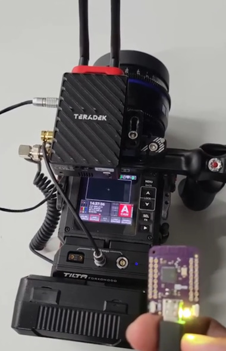
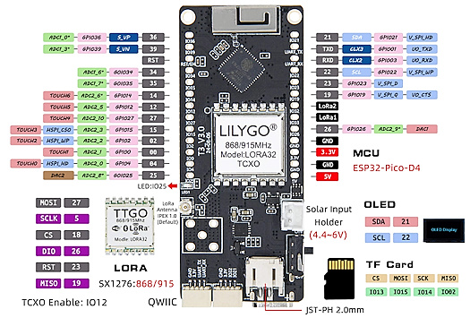
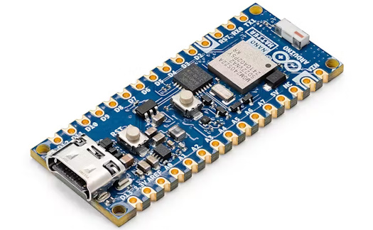
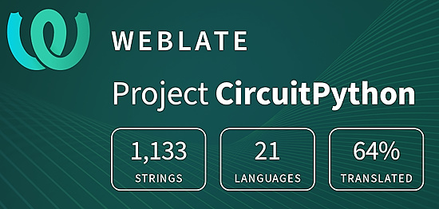

- [ ] Library and info updates
- [ ] change date
- [ ] update title
- [ ] Feature story
- [ ] Update  for images
- [ ] Update ICYDNCI
- [ ] All images 550w max only
- [ ] Link "View this email in your browser."

News Sources

- [Adafruit Playground](https://adafruit-playground.com/)
- Twitter: [CircuitPython](https://twitter.com/search?q=circuitpython&src=typed_query&f=live), [MicroPython](https://twitter.com/search?q=micropython&src=typed_query&f=live) and [Python](https://twitter.com/search?q=python&src=typed_query)
- [Raspberry Pi News](https://www.raspberrypi.com/news/)
- Mastodon [CircuitPython](https://octodon.social/tags/CircuitPython) and [MicroPython](https://octodon.social/tags/MicroPython)
- [hackster.io CircuitPython](https://www.hackster.io/search?q=circuitpython&i=projects&sort_by=most_recent) and [MicroPython](https://www.hackster.io/search?q=micropython&i=projects&sort_by=most_recent)
- YouTube: [CircuitPython](https://www.youtube.com/results?search_query=circuitpython&sp=CAI%253D), [MicroPython](https://www.youtube.com/results?search_query=micropython&sp=CAI%253D)
- Instructables: [CircuitPython](https://www.instructables.com/search/?q=circuitpython&projects=all&sort=Newest), [MicroPython](https://www.instructables.com/search/?q=micropython&projects=all&sort=Newest), [Raspberry Pi Python](https://www.instructables.com/search/?q=raspberry+pi+python&projects=all&sort=Newest)
- [hackaday CircuitPython](https://hackaday.com/blog/?s=circuitpython) and [MicroPython](https://hackaday.com/blog/?s=micropython)
- [python.org](https://www.python.org/)
- [Python Insider - dev team blog](https://pythoninsider.blogspot.com/)
- Individuals: [Jeff Geerling](https://www.jeffgeerling.com/blog), [Yakroo](https://x.com/Yakroo5077)
- Tom's Hardware: [CircuitPython](https://www.tomshardware.com/search?searchTerm=circuitpython&articleType=all&sortBy=publishedDate) and [MicroPython](https://www.tomshardware.com/search?searchTerm=micropython&articleType=all&sortBy=publishedDate) and [Raspberry Pi](https://www.tomshardware.com/search?searchTerm=raspberry%20pi&articleType=all&sortBy=publishedDate)
- [hackaday.io newest projects MicroPython](https://hackaday.io/projects?tag=micropython&sort=date) and [CircuitPython](https://hackaday.io/projects?tag=circuitpython&sort=date)
- [Google News Python](https://news.google.com/topics/CAAqIQgKIhtDQkFTRGdvSUwyMHZNRFY2TVY4U0FtVnVLQUFQAQ?hl=en-US&gl=US&ceid=US%3Aen)
- hackaday.io - [CircuitPython](https://hackaday.io/search?term=circuitpython) and [MicroPython](https://hackaday.io/search?term=micropython)

View this email in your browser. **Warning: Flashing Imagery**

Welcome to the latest Python on Microcontrollers newsletter! *insert 2-3 sentences from editor (what's in overview, banter)* - *Anne Barela, Editor*

We're on [Discord](https://discord.gg/HYqvREz), [Twitter](https://twitter.com/search?q=circuitpython&src=typed_query&f=live), and for past newsletters - [view them all here](https://www.adafruitdaily.com/category/circuitpython/). If you're reading this on the web, [subscribe here](https://www.adafruitdaily.com/). Here's the news this week:

## Raspberry Pi Release `piolib` for Raspberry Pi 5 RP1 Programming

PIOlib/libPIO is a user-space API to the `rp1-pio` driver, which gives access to the PIO hardware of the RP1 on a Raspberry Pi 5. It takes the form of a clone of the PICO SDK PIO API, where most of the methods are implemented as RPC calls to RP1 - [GitHub](https://github.com/raspberrypi/utils/tree/master/piolib) and [NeoPixel Example](https://github.com/raspberrypi/utils/blob/master/piolib/examples/ws2812.c).

## An Updated CircuitPython Plug-in for VSCode is Available

Will S Merkens has come to the rescue of many in the community who have asked for a working VSCode extension for CircuitPython development. Will forked an older, broken version and has applied fixes - [GitHub](https://github.com/wmerkens/vscode-circuitpython).

## Arduino Releases Its First Zephyr Cores, as It Makes the Move Away From Arm's Discontinued Mbed

Arduino has released its first microcontroller cores to feature the Zephyr real-time operating system, as it looks to transition away from Arm's discontinued Mbed platform for its devices — with beta builds now available - [hackster.io](https://www.hackster.io/news/arduino-releases-its-first-zephyr-cores-as-it-makes-the-move-away-from-arm-s-discontinued-mbed-0259a47ff179).

> "Last July, when we announced the beginning of the transition from Mbed to Zephyr, we promised to release the first beta by the end of 2024," the Arduino team explains. "Today, we are excited to announce the first release of Arduino cores with ZephyrOS in beta! We are transitioning Arduino cores to ZephyrOS to ensure continued support and innovation for developers. This change follows Arm’s deprecation of MbedOS, which has historically powered some of our cores."

## Feature

text - [site](url).

## Raspberry Pi Boosts Pi 5 Performance With SDRAM Tuning

Raspberry Pi engineers tweaked SDRAM timings and other memory settings on the Pi, resulting in a 10-20% speed boost at the default 2.4 GHz clock. Jeff Geerling tested overclocking, which resulted in a 32% speedup at 3.2 GHz. Changes may roll out in a firmware update for all Pi 5 and Pi 4 users soon - [Jeff Geerling](https://www.jeffgeerling.com/blog/2024/raspberry-pi-boosts-pi-5-performance-sdram-tuning).

## 10 Python Libraries Every Developer Should Know

Are you a developer who enjoys coding in Python? If so, there are a few (big) Python libraries you can add to your dev toolbox. As a developer, you should be comfortable with debugging, logging, and unit testing. Besides, you’ll need to work with data sources, account for data validation, and build APIs - [KDnuggets](https://www.kdnuggets.com/10-python-libraries-every-developer-should-know).

## This Week's Python Streams

Python on Hardware is all about building a cooperative ecosphere which allows contributions to be valued and to grow knowledge. Below are the streams within the last week focusing on the community.

**CircuitPython Deep Dive Stream**

[Last Friday](link), Scott streamed work on {subject}.

You can see the latest video and past videos on the Adafruit YouTube channel under the Deep Dive playlist - [YouTube](https://www.youtube.com/playlist?list=PLjF7R1fz_OOXBHlu9msoXq2jQN4JpCk8A).

**CircuitPython Parsec**

John Park’s CircuitPython Parsec this week is on {subject} - [Adafruit Blog](link) and [YouTube](link).

Catch all the episodes in the [YouTube playlist](https://www.youtube.com/playlist?list=PLjF7R1fz_OOWFqZfqW9jlvQSIUmwn9lWr).

**CircuitPython Weekly Meeting**

CircuitPython Weekly Meeting for December 2, 2024 ([notes](https://github.com/adafruit/adafruit-circuitpython-weekly-meeting/blob/main/2024/2024-12-02.md)) [on YouTube](https://youtu.be/5amPOjbkF3s)

## Project of the Week: Porting Adventure to MicroPython

In 1977, on a DEC PDP-10, the text game Adventure was coded in FORTRAN and countless CPU hours have been burned by players worldwide playing it. Mike Markowski decided to port the FORTRAN ([here](https://mirror.ifarchive.org/if-archive/games/source/adv350-pdp10.tar.gz)) into MicroPython. Success is having a running version on an HP Prime calculator and PC - [Mike Markowski](https://udel.edu/~mm/hp/adventure/).

## Popular Last Week

What was the most popular, most clicked link, in [last week's newsletter](newslink)? [title](url).

Did you know you can read past issues of this newsletter in the Adafruit Daily Archive? [Check it out](https://www.adafruitdaily.com/category/circuitpython/).

## New Notes from Adafruit Playground

[Adafruit Playground](https://adafruit-playground.com/) is a new place for the community to post their projects and other making tips/tricks/techniques. Ad-free, it's an easy way to publish your work in a safe space for free.

Remix: Cedar Grove Weather Architecture v2.0 - [Adafruit Playground](https://adafruit-playground.com/u/CGrover/pages/remix-cedar-grove-weather-architecture-v2-0).

text - [Adafruit Playground](url).

text - [Adafruit Playground](url).

## News From Around the Web

> "A DIY remote shutter control for a redkomodo using Adafruit's CircuitPython, an ESP32-s3 and websockets. I'm still working on displaying the right LED colors. Check the websocket client library for CircuitPython [here](https://github.com/intGus/cpwebsockets)"  - [BlueSky](https://bsky.app/profile/gusdiaz.dev/post/3lc2gya73us2p).

Use this Python class to hide messages inside of any book. - [youtube](https://youtu.be/m44KlRqjl7g?si=MW9UXpbJrff-h1vA) and [github](https://github.com/FoamyGuy/Python_Book_Cipher).

text - [site](url).

text - [site](url).

text - [site](url).

text - [site](url).

text - [site](url).

text - [site](url).

text - [site](url).

text - [site](url).

text - [site](url).

text - [site](url).

text - [site](url).

text - [site](url).

text - [site](url).

text - [site](url).

text - [site](url).

text - [site](url).

text - [site](url).

## New

The LILYGO T3 V3.0 TCXO is a ESP32-PICO-D4 Board with LoRa, Wi-Fi, and BLE Connectivity - [LinuxGizmos](https://linuxgizmos.com/low-cost-esp32-pico-d4-board-with-lora-wi-fi-and-ble-connectivity/).

Following a "community preview" soft launch, the Arduino Nano Matter, targeting Matter-compliant smart home projects, is now available - [hackster.io](https://www.hackster.io/news/arduino-s-silicon-labs-mgm240s-powered-arduino-nano-matter-launches-as-a-fully-fledged-dev-board-4bd4b1884fac) and [YouTube](https://youtu.be/NxHybWaNev0https://youtu.be/NxHybWaNev0).

## New Boards Supported by CircuitPython

The number of supported microcontrollers and Single Board Computers (SBC) grows every week. This section outlines which boards have been included in CircuitPython or added to [CircuitPython.org](https://circuitpython.org/).

This week there were (#/no) new boards added:

- [Board name](url)
- [Board name](url)
- [Board name](url)

*Note: For non-Adafruit boards, please use the support forums of the board manufacturer for assistance, as Adafruit does not have the hardware to assist in troubleshooting.*

Looking to add a new board to CircuitPython? It's highly encouraged! Adafruit has four guides to help you do so:

- [How to Add a New Board to CircuitPython](https://learn.adafruit.com/how-to-add-a-new-board-to-circuitpython/overview)
- [How to add a New Board to the circuitpython.org website](https://learn.adafruit.com/how-to-add-a-new-board-to-the-circuitpython-org-website)
- [Adding a Single Board Computer to PlatformDetect for Blinka](https://learn.adafruit.com/adding-a-single-board-computer-to-platformdetect-for-blinka)
- [Adding a Single Board Computer to Blinka](https://learn.adafruit.com/adding-a-single-board-computer-to-blinka)

## New Learn Guides

The Adafruit Learning System has over 3,000 free guides for learning skills and building projects including using Python.

[Using ItsaSNAP for HomeKit PIR Motion Detection](https://learn.adafruit.com/itsasnap-homekit-pir-motion-detection) from [Trevor Beaton](https://learn.adafruit.com/u/Seekwill)

## CircuitPython Libraries

The CircuitPython library numbers are continually increasing, while existing ones continue to be updated. Here we provide library numbers and updates!

To get the latest Adafruit libraries, download the [Adafruit CircuitPython Library Bundle](https://circuitpython.org/libraries). To get the latest community contributed libraries, download the [CircuitPython Community Bundle](https://circuitpython.org/libraries).

If you'd like to contribute to the CircuitPython project on the Python side of things, the libraries are a great place to start. Check out the [CircuitPython.org Contributing page](https://circuitpython.org/contributing). If you're interested in reviewing, check out Open Pull Requests. If you'd like to contribute code or documentation, check out Open Issues. We have a guide on [contributing to CircuitPython with Git and GitHub](https://learn.adafruit.com/contribute-to-circuitpython-with-git-and-github), and you can find us in the #help-with-circuitpython and #circuitpython-dev channels on the [Adafruit Discord](https://adafru.it/discord).

You can check out this [list of all the Adafruit CircuitPython libraries and drivers available](https://github.com/adafruit/Adafruit_CircuitPython_Bundle/blob/master/circuitpython_library_list.md). 

The current number of CircuitPython libraries is **###**!

**New Libraries**

Here's this week's new CircuitPython libraries:

* [library](url)

**Updated Libraries**

Here's this week's updated CircuitPython libraries:

* [library](url)

## What’s the CircuitPython team up to this week?

What is the team up to this week? Let’s check in:

**Dan**

I am adding a CircuitPython interface to cryptographic functionality provided by mbedTLS. We'll use that functionality to do crypography for CircuitMatter in CircuitPython.

**Tim**

I have been continuing to work on issues in the Libraries. This week I worked on a few fixes in the turtle graphics repo. I've added TypeAnnotations to a few libraries and am moving them to use ruff in their GitHub Actions as well so that the annotations and ruff change can go under a single release. I also worked on a change to circuitpython.org to split up the raspberrypi processor family into rp2040 and rp2350 so that it's possible to search by the specific chip now.

**Jeff**

I've been back to working on CircuitPython bugs, including work to resolve an audio glitch that occurred when using the `MP3Decoder.open` method to switch streams before an earlier stream finished.

**Scott**

I've started prototyping building CircuitPython on top of Zephyr. I'm using my own async Python code to build the CircuitPython bits when delegated to from Zephyr's cmake. I've gotten it to the point that linking CircuitPython is missing core pieces like flash functions. This means I'm starting to interface from CircuitPython into the Zephyr APIs. The main benefit of this is that these implementations will work for any Zephyr supported board!

**Liz**

I took last week off for the Thanksgiving holiday. It was a nice restful break and now I’m ready to pump out some work between now and Christmas/New Years. Before my week-long nap, I published the [Feather RP2350 Audio Reactive Video Synth guide](https://learn.adafruit.com/feather-rp2350-audio-reactive-video-synth). This project uses a Feather RP2350 with HSTX to DVI to run a video synthesizer that uses analog potentiometers and audio input with FFT to control fun animations. I’m really proud of this project. It had been a goal of mine to work on a video synth in CircuitPython and I was thrilled to finally be able to do it with bonus points for audio reactivity.

## Upcoming Events

PyLadies Conference (PyLadiesCon) is a transformative event designed to promote diversity, learning, and empowerment within the Python community. December 6-8, 2024 online - [PyLadies](https://conference.pyladies.com/).

The next MicroPython Meetup in Melbourne will be on December 11th – [Meetup](https://www.meetup.com/micropython-meetup/events). You can see recordings of previous meetings on [YouTube](https://www.youtube.com/@MicroPythonOfficial). 

The community is coming back to Pittsburgh, Pennsylvania for PyCon US 2025 May 14 - May 22, 2025 - [us.pycon.org](https://us.pycon.org/2025/).

**Send Your Events In**

If you know of virtual events or upcoming events, please let us know via email to cpnews(at)adafruit(dot)com.

## Latest Releases

CircuitPython's stable release is [#.#.#](https://github.com/adafruit/circuitpython/releases/latest) and its unstable release is [#.#.#-##.#](https://github.com/adafruit/circuitpython/releases). New to CircuitPython? Start with our [Welcome to CircuitPython Guide](https://learn.adafruit.com/welcome-to-circuitpython).

[2024####](https://github.com/adafruit/Adafruit_CircuitPython_Bundle/releases/latest) is the latest Adafruit CircuitPython library bundle.

[2024####](https://github.com/adafruit/CircuitPython_Community_Bundle/releases/latest) is the latest CircuitPython Community library bundle.

[v#.#.#](https://micropython.org/download) is the latest MicroPython release. Documentation for it is [here](http://docs.micropython.org/en/latest/pyboard/).

[#.#.#](https://www.python.org/downloads/) is the latest Python release. The latest pre-release version is [#.#.#](https://www.python.org/download/pre-releases/).

[#,### Stars](https://github.com/adafruit/circuitpython/stargazers) Like CircuitPython? [Star it on GitHub!](https://github.com/adafruit/circuitpython)

## Call for Help -- Translating CircuitPython is now easier than ever

One important feature of CircuitPython is translated control and error messages. With the help of fellow open source project [Weblate](https://weblate.org/), we're making it even easier to add or improve translations. 

Sign in with an existing account such as GitHub, Google or Facebook and start contributing through a simple web interface. No forks or pull requests needed! As always, if you run into trouble join us on [Discord](https://adafru.it/discord), we're here to help.

## NUMBER Thanks

The Adafruit Discord community, where we do all our CircuitPython development in the open, reached over NUMBER humans - thank you! Adafruit believes Discord offers a unique way for Python on hardware folks to connect. Join today at [https://adafru.it/discord](https://adafru.it/discord).

## ICYMI - In case you missed it

Python on hardware is the Adafruit Python video-newsletter-podcast! The news comes from the Python community, Discord, Adafruit communities and more and is broadcast on ASK an ENGINEER Wednesdays. The complete Python on Hardware weekly videocast [playlist is here](https://www.youtube.com/playlist?list=PLjF7R1fz_OOXRMjM7Sm0J2Xt6H81TdDev). The video podcast is on [iTunes](https://itunes.apple.com/us/podcast/python-on-hardware/id1451685192?mt=2), [YouTube](http://adafru.it/pohepisodes), [Instagram](https://www.instagram.com/adafruit/channel/)), and [XML](https://itunes.apple.com/us/podcast/python-on-hardware/id1451685192?mt=2).

[The weekly community chat on Adafruit Discord server CircuitPython channel - Audio / Podcast edition](https://itunes.apple.com/us/podcast/circuitpython-weekly-meeting/id1451685016) - Audio from the Discord chat space for CircuitPython, meetings are usually Mondays at 2pm ET, this is the audio version on [iTunes](https://itunes.apple.com/us/podcast/circuitpython-weekly-meeting/id1451685016), Pocket Casts, [Spotify](https://adafru.it/spotify), and [XML feed](https://adafruit-podcasts.s3.amazonaws.com/circuitpython_weekly_meeting/audio-podcast.xml).

## Contribute

The CircuitPython Weekly Newsletter is a CircuitPython community-run newsletter emailed every Monday. The complete [archives are here](https://www.adafruitdaily.com/category/circuitpython/). It highlights the latest CircuitPython related news from around the web including Python and MicroPython developments. To contribute, edit next week's draft [on GitHub](https://github.com/adafruit/circuitpython-weekly-newsletter/tree/gh-pages/_drafts) and [submit a pull request](https://help.github.com/articles/editing-files-in-your-repository/) with the changes. You may also tag your information on Twitter with #CircuitPython. 

Join the Adafruit [Discord](https://adafru.it/discord) or [post to the forum](https://forums.adafruit.com/viewforum.php?f=60) if you have questions.
