- [ ] Library and info updates
- [ ] change date
- [ ] update title
- [ ] Feature story
- [ ] Update  for images
- [ ] Update ICYDNCI
- [ ] All images 550w max only
- [ ] Link "View this email in your browser."

News Sources

- [Adafruit Playground](https://adafruit-playground.com/)
- Twitter: [CircuitPython](https://twitter.com/search?q=circuitpython&src=typed_query&f=live), [MicroPython](https://twitter.com/search?q=micropython&src=typed_query&f=live) and [Python](https://twitter.com/search?q=python&src=typed_query)
- [Raspberry Pi News](https://www.raspberrypi.com/news/)
- Mastodon [CircuitPython](https://octodon.social/tags/CircuitPython) and [MicroPython](https://octodon.social/tags/MicroPython)
- [hackster.io CircuitPython](https://www.hackster.io/search?q=circuitpython&i=projects&sort_by=most_recent) and [MicroPython](https://www.hackster.io/search?q=micropython&i=projects&sort_by=most_recent)
- YouTube: [CircuitPython](https://www.youtube.com/results?search_query=circuitpython&sp=CAI%253D), [MicroPython](https://www.youtube.com/results?search_query=micropython&sp=CAI%253D)
- Instructables: [CircuitPython](https://www.instructables.com/search/?q=circuitpython&projects=all&sort=Newest), [MicroPython](https://www.instructables.com/search/?q=micropython&projects=all&sort=Newest), [Raspberry Pi Python](https://www.instructables.com/search/?q=raspberry+pi+python&projects=all&sort=Newest)
- [hackaday CircuitPython](https://hackaday.com/blog/?s=circuitpython) and [MicroPython](https://hackaday.com/blog/?s=micropython)
- [python.org](https://www.python.org/)
- [Python Insider - dev team blog](https://pythoninsider.blogspot.com/)
- Individuals: [Jeff Geerling](https://www.jeffgeerling.com/blog), [Yakroo](https://x.com/Yakroo5077)
- Tom's Hardware: [CircuitPython](https://www.tomshardware.com/search?searchTerm=circuitpython&articleType=all&sortBy=publishedDate) and [MicroPython](https://www.tomshardware.com/search?searchTerm=micropython&articleType=all&sortBy=publishedDate) and [Raspberry Pi](https://www.tomshardware.com/search?searchTerm=raspberry%20pi&articleType=all&sortBy=publishedDate)
- [hackaday.io newest projects MicroPython](https://hackaday.io/projects?tag=micropython&sort=date) and [CircuitPython](https://hackaday.io/projects?tag=circuitpython&sort=date)
- [Google News Python](https://news.google.com/topics/CAAqIQgKIhtDQkFTRGdvSUwyMHZNRFY2TVY4U0FtVnVLQUFQAQ?hl=en-US&gl=US&ceid=US%3Aen)
- hackaday.io - [CircuitPython](https://hackaday.io/search?term=circuitpython) and [MicroPython](https://hackaday.io/search?term=micropython)

View this email in your browser. **Warning: Flashing Imagery**

Welcome to the latest Python on Microcontrollers newsletter! *insert 2-3 sentences from editor (what's in overview, banter)* - *Anne Barela, Editor*

We're on [Discord](https://discord.gg/HYqvREz), [Twitter/X](https://twitter.com/search?q=circuitpython&src=typed_query&f=live), [BlueSky](https://bsky.app/profile/circuitpython.org) and for past newsletters - [view them all here](https://www.adafruitdaily.com/category/circuitpython/). If you're reading this on the web, [subscribe here](https://www.adafruitdaily.com/). Here's the news this week:

## The Year in Review

[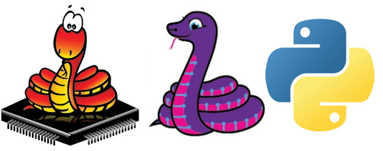](https://circuitpython.org/)

Without hype, this has been a very good year for using Python on hardware. The state of the art in both hardware and software has increased. More folks are joining in using Python on hardware. The language is easier to use and faster. And the hardware ecosystem has grown considerably.

Changes over the past year, from the [January 1st newsletter](https://www.adafruitdaily.com/2024/01/01/python-on-microcontrollers-newsletter-micropython-v1-22-0-is-out-freertos-adds-multiprocessing-and-much-more-circuitpython-python-micropython-thepsf-raspberry_pi/) to today:

| Event | January | December |
|-----------------------------| -------- | ------- |
| CircuitPython Version       | 8.2.9    | 9.2.1   |
| MicroPython Version         | v1.22.0  | v1.24.1 |
| Python Version              | 3.12.1   | 3.13.1  |
| CircuitPython Compatible Boards | 596  | 708     |
| CircuitPython Libraries     | 471      | 508
| Newsletter Subscribers      | 10,735   | 11,716  |

## Hardware Acceleration for uLab in MicroPython

In the past, digital signal processing and machine learning applications on microcontroller platforms were bound by the numerical processing speed. Several years ago, ARM released the definition of the Helium extension to the Cortex-M CPU instruction set, designed to deliver significant numerical performance improvements of certain common operations.

On many variants of MicroPython, [ulab](https://github.com/v923z/micropython-ulab/), the numpy look-alike numerical library has been a popular choice for those who want to retain the ease of Python, but need to crunch numbers fast. The ulab project is planning on raising the bar and exploiting the advantages of ARM's Helium processors to accelerate many of its numerical methods. See more on the [OpenMV Blog](https://openmv.io/blogs/news/flir-boson-support-coming-soon).

## PIOLib: A Userspace Library for PIO Control

[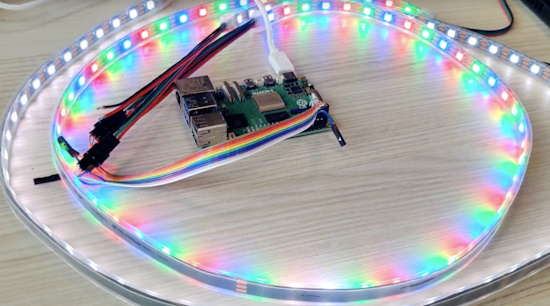](https://www.raspberrypi.com/news/piolib-a-userspace-library-for-pio-control/)

As discussed in the newsletter last week, Raspberry Pi has released a user library for working with the RP1 processor on the Raspberry Pi 5, allowing control of timing sensitive devices like NeoPixel LED strands. Raspberry Pi News goes into detail about this new library - [Raspberry Pi News](https://www.raspberrypi.com/news/piolib-a-userspace-library-for-pio-control/).

Jeff Epler at Adafruit has [completed CircuitPython bindings](https://github.com/jepler/pi5-pio-protomatter) for PIOlib and it will be added to an upcoming release of CircuitPython. Check out a [blog post](https://blog.adafruit.com/2024/12/10/raspberry-pi-5-rp1-chip-support-for-neopixels-with-python-bindings-coming-soon/) and [YouTube video](https://www.youtube.com/watch?v=B4_wbllpw0U).

## The CircuitPython Show Returns

The CircuitPython Show will return in mid-January! It will feature interviews with CircuitPython community members, panel discussions, and topics with new and returning guests. Topics will cover designing a PCB, building CircuitPython, creating a library, creating games with CircuitPython, and more. Find the show wherever you get your podcasts - [BlueSky](https://bsky.app/profile/circuitpythonshow.com/post/3ldmd76etik2h) and [Mastodon](https://hachyderm.io/@prcutler/113675993219605820).

## Gurubase Looks to Use AI for MicroPython

[Gurubase.io](https://gurubase.io/) is looking to build a centralized, open-source, tool-focused knowledge base. Each "guru" in Gurubase is equipped with custom knowledge to answer user questions based on data related to the respective tool. MicroPython Guru has been manually added to Gurubase. [MicroPython Guru](https://gurubase.io/g/micropython) uses the data from the MicroPython GitHub repo and data from the docs to answer questions by leveraging the LLM.

The goal is to give MicroPython an AI assistant available to help users with their questions. It appears to be a work in progress - [Gurubase](https://gurubase.io/g/micropython) and [GitHub Pull Request](https://github.com/micropython/micropython/pull/16451).

## Five of the Best Budget-Friendly Single Board Computers (SBC)

[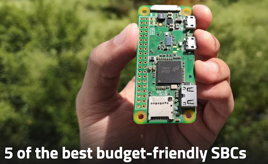](https://www.xda-developers.com/best-budget-friendly-sbcs/)

Single-Board Computers are quite popular in the tinkering crowd thanks to their miniature designs, high versatility, and low power consumption. That said, the prices of SBCs have skyrocketed in recent times, with many high-end boards costing well above $100 – without taking any peripherals or accessories into account.

Thankfully, the era of affordable SBCs isn’t dead yet, as you can still find a handful of boards that offer the classic SBC experience - [XDA](https://www.xda-developers.com/best-budget-friendly-sbcs/).

## This Week's Python Streams

Python on Hardware is all about building a cooperative ecosphere which allows contributions to be valued and to grow knowledge. Below are the streams within the last week focusing on the community.

**CircuitPython Deep Dive Stream**

[Last Friday](link), Tim streamed work on {subject}.

You can see the latest video and past videos on the Adafruit YouTube channel under the Deep Dive playlist - [YouTube](https://www.youtube.com/playlist?list=PLjF7R1fz_OOXBHlu9msoXq2jQN4JpCk8A).

**CircuitPython Parsec**

John Park’s CircuitPython Parsec this week is on {subject} - [Adafruit Blog](link) and [YouTube](link).

Catch all the episodes in the [YouTube playlist](https://www.youtube.com/playlist?list=PLjF7R1fz_OOWFqZfqW9jlvQSIUmwn9lWr).

**CircuitPython Weekly Meeting**

CircuitPython Weekly Meeting for December 16, 2024 ([notes](https://github.com/adafruit/adafruit-circuitpython-weekly-meeting/blob/main/2024/2024-12-16.md)) [on YouTube](https://youtu.be/hqbNWkzNeA4?si=Z-1QvCfuSqtUj35H).

NOTE: The next meeting will be on January 6, 2025.

## Project of the Week: Tangible Prayers with a Twist

[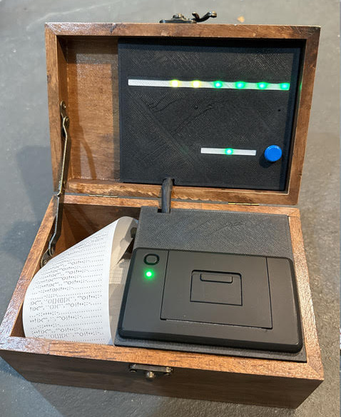](https://www.molecularist.com/2024/12/project-god-box-tangible-prayers-with-a-twist.html)

Charlie, in a conversation with Dan Alroy, heard mentioned of a God Box. Basically, it’s a box you put in written snippets of, say, a prayer or a petition. Charlie wanted to do something akin to Tibetan prayer flags, where you record a prayer and it is converted into something you could hang and let the wind carry off what what was recorded.

The build uses a Raspberry Pi Pico programmed in CircuitPython. An Adafruit PDM microphone captures audio with NeoPixel strips acting as a VU meter. Output is to a thermal printer - [Molecularist](https://www.molecularist.com/2024/12/project-god-box-tangible-prayers-with-a-twist.html).

> "The main twist is that what comes out on the strip is based on the recording, but encoded in a visually interesting way. You can then store it in the god box or hang it, but only you and your higher power know what is encoded on that strip."

## Popular Last Week

What was the most popular, most clicked link, in [last week's newsletter](https://www.adafruitdaily.com/2024/12/16/python-on-microcontrollers-newsletter-new-raspberry-pi-gear-adafruit-goes-to-college-mu-sunsetting-and-more-circuitpython-python-micropython-thepsf-raspberry_pi/)? [CircuitPython comes to BlueSky](https://bsky.app/profile/circuitpython.org).

Did you know you can read past issues of this newsletter in the Adafruit Daily Archive? [Check it out](https://www.adafruitdaily.com/category/circuitpython/).

## Adafruit Playground

[Adafruit Playground](https://adafruit-playground.com/) is a new place for the community to post their projects and other making tips/tricks/techniques. Ad-free, it's an easy way to publish your work in a safe space for free.

## News From Around the Web

[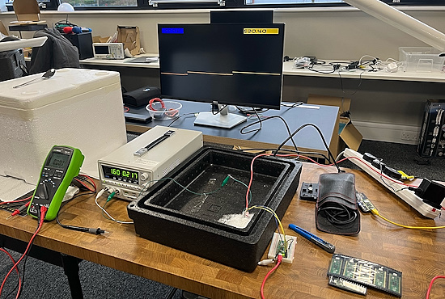](https://bsky.app/profile/rebelmike.bsky.social/post/3ldqbphm3yk2g)

Mike Bell is actively trying to overclock the new Raspberry Pi Pico 2. He has succeeded in running one at 840 MHz with various tweaks and dry ice cooling - [BlueSky](https://bsky.app/profile/rebelmike.bsky.social/post/3ldqbphm3yk2g).

[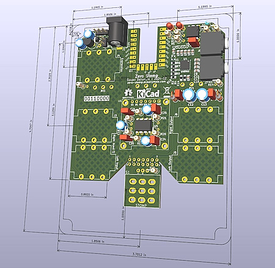](https://x.com/coopersnout/status/1869040590505259244)

Making a RP2350-powered guitar pedal with a custom PCB and CircuitPython - [X](https://x.com/coopersnout/status/1869040590505259244).

Hacking the IKEA Vindriktning air quality sensor with CircuitPython and an ESP32 - [X](https://bsky.app/profile/biglesp.bsky.social/post/3ldl3r7z37z2r) and [YouTube](https://www.youtube.com/watch?v=A0qONiRQqoY).

[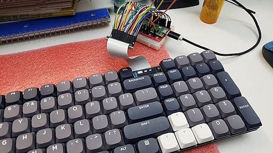](https://bsky.app/profile/matzelectronics.bsky.social/post/3ldn6wjcxg22r)

Turning a mechanical keyboard into a USB HID device with Raspberry Pi Pico and CircuitPython - [X](https://bsky.app/profile/matzelectronics.bsky.social/post/3ldn6wjcxg22r).

[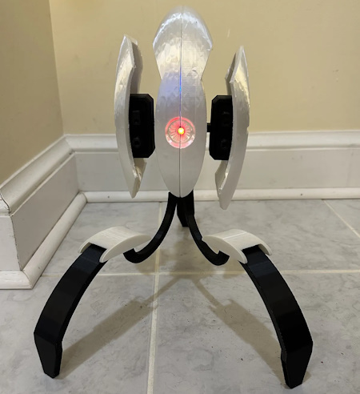](https://www.tomshardware.com/raspberry-pi/raspberry-pi-powers-sentry-turret-straight-out-of-the-portal-franchise)

Raspberry Pi powers sentry turret straight out of the 'Portal' franchise uses Python - [Tom's Hardware](https://www.tomshardware.com/raspberry-pi/raspberry-pi-powers-sentry-turret-straight-out-of-the-portal-franchise) and [Reddit](https://www.reddit.com/r/raspberry_pi/comments/1hevcx0/portal_sentry_turret/).

[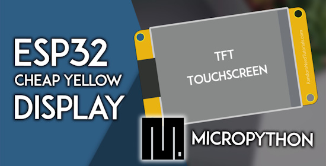](https://randomnerdtutorials.com/micropython-cheap-yellow-display-board-cyd-esp32-2432s028r/)

Using MicroPython with an ESP32-based Cheap Yellow Display Board (CYD) - [Random Nerd Tutorials](https://randomnerdtutorials.com/micropython-cheap-yellow-display-board-cyd-esp32-2432s028r/).

[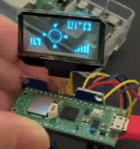](https://x.com/sozoraemon/status/1868961698906021947?t=OE1ivJdmpIff7KBYmpROlw&s=03)

Transparent OLED display graphics with a Raspberry Pi Pico and MicroPython - [X](https://x.com/sozoraemon/status/1868961698906021947?t=OE1ivJdmpIff7KBYmpROlw&s=03).

text - [site](url).

text - [site](url).

text - [site](url).

text - [site](url).

text - [site](url).

text - [site](url).

text - [site](url).

text - [site](url).

text - [site](url).

[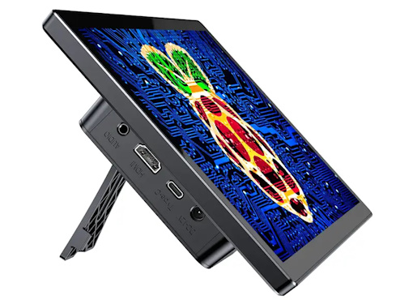](https://magpi.raspberrypi.com/articles/upi-b7-raspberry-pi-case-with-touchscreen-review)

UPi B7 Raspberry Pi 3B+ and Raspberry Pi 4 case with touchscreen review - [The MagPi](https://magpi.raspberrypi.com/articles/upi-b7-raspberry-pi-case-with-touchscreen-review).

[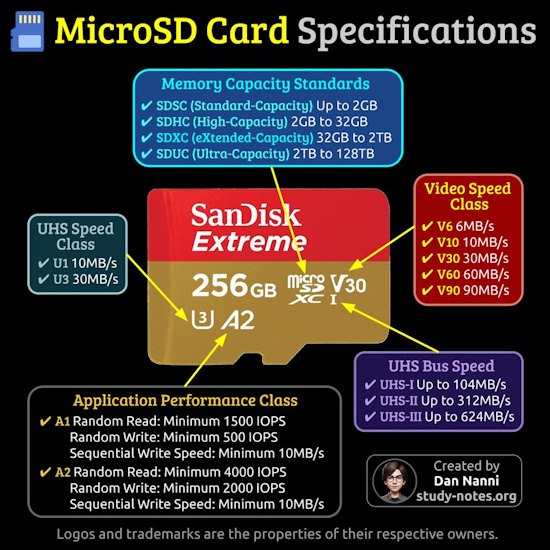](https://x.com/xmodulo/status/1869004616874311798)

A graphic summarizing MicroSD card specifications defining storage capacity (e.g., SDHC, SDXC), speed classes (e.g., V10, U3), UHS bus speed, application performance classes (e.g., A2, A2), etc. - [X](https://x.com/xmodulo/status/1869004616874311798).

## New

[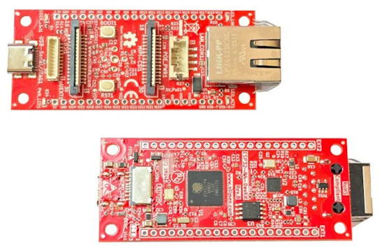](https://www.cnx-software.com/2024/12/16/olimex-esp32-p4-devkit-offers-ethernet-usb-jtag-mipi-dsi-and-csi-interfaces/)

Olimex ESP32-P4-DevKit offers Ethernet, USB JTAG, MIPI DSI and CSI interfaces - [CNX Software](https://www.cnx-software.com/2024/12/16/olimex-esp32-p4-devkit-offers-ethernet-usb-jtag-mipi-dsi-and-csi-interfaces/).

Elecrow launches the Pico W5, a dual-band alternative to the Raspberry Pi Pico 2 W - [hackster.io](https://www.hackster.io/news/elecrow-launches-the-pico-w5-a-dual-band-alternative-to-the-raspberry-pi-pico-2-w-0d41c0b1365f).

[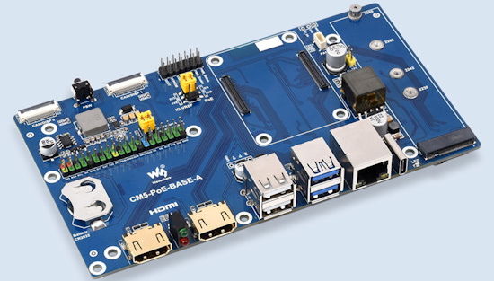](https://www.cnx-software.com/2024/12/17/raspberry-pi-cm5-gets-carrier-boards-poe-poe-plus/)

Two CM5 carrier boards with built-in PoE/PoE+ - [CNX Software](https://www.cnx-software.com/2024/12/17/raspberry-pi-cm5-gets-carrier-boards-poe-poe-plus/).

- [Waveshare CM5-PoE-BASE-A RPi CM5 IO Board](https://www.waveshare.com/cm5-poe-base-a.htm?sku=29488)
- [Pineboards Modulo5 IO PoE+ Carrier Board](https://pineboards.io/products/modulo5-io-poe)

Presto is a new RP2350-powered, connected desktop companion by Pimoroni, featuring a 4" square (480 x 480 pixel) touchscreen, built into an elegant black aluminium stand with bonus RGB backlighting - [Pimoroni](https://shop.pimoroni.com/products/presto?variant=54894104019323).

## New Boards Supported by CircuitPython

The number of supported microcontrollers and Single Board Computers (SBC) grows every week. This section outlines which boards have been included in CircuitPython or added to [CircuitPython.org](https://circuitpython.org/).

This week there were (#/no) new boards added:

- [Board name](url)
- [Board name](url)
- [Board name](url)

*Note: For non-Adafruit boards, please use the support forums of the board manufacturer for assistance, as Adafruit does not have the hardware to assist in troubleshooting.*

Looking to add a new board to CircuitPython? It's highly encouraged! Adafruit has four guides to help you do so:

- [How to Add a New Board to CircuitPython](https://learn.adafruit.com/how-to-add-a-new-board-to-circuitpython/overview)
- [How to add a New Board to the circuitpython.org website](https://learn.adafruit.com/how-to-add-a-new-board-to-the-circuitpython-org-website)
- [Adding a Single Board Computer to PlatformDetect for Blinka](https://learn.adafruit.com/adding-a-single-board-computer-to-platformdetect-for-blinka)
- [Adding a Single Board Computer to Blinka](https://learn.adafruit.com/adding-a-single-board-computer-to-blinka)

## New Learn Guides

[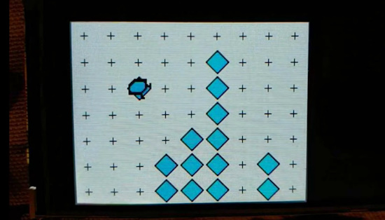](https://learn.adafruit.com/guides/latest)

The Adafruit Learning System has over 3,000 free guides for learning skills and building projects including using Python.

[Karel The Robot In CircuitPython](https://learn.adafruit.com/karel-the-robot-in-circuitpython) from [Tim C](https://learn.adafruit.com/u/Foamyguy)

## Updated Learn Guides

[title](url)

## CircuitPython Libraries

The CircuitPython library numbers are continually increasing, while existing ones continue to be updated. Here we provide library numbers and updates!

To get the latest Adafruit libraries, download the [Adafruit CircuitPython Library Bundle](https://circuitpython.org/libraries). To get the latest community contributed libraries, download the [CircuitPython Community Bundle](https://circuitpython.org/libraries).

If you'd like to contribute to the CircuitPython project on the Python side of things, the libraries are a great place to start. Check out the [CircuitPython.org Contributing page](https://circuitpython.org/contributing). If you're interested in reviewing, check out Open Pull Requests. If you'd like to contribute code or documentation, check out Open Issues. We have a guide on [contributing to CircuitPython with Git and GitHub](https://learn.adafruit.com/contribute-to-circuitpython-with-git-and-github), and you can find us in the #help-with-circuitpython and #circuitpython-dev channels on the [Adafruit Discord](https://adafru.it/discord).

You can check out this [list of all the Adafruit CircuitPython libraries and drivers available](https://github.com/adafruit/Adafruit_CircuitPython_Bundle/blob/master/circuitpython_library_list.md). 

The current number of CircuitPython libraries is **###**!

**New Libraries**

Here's this week's new CircuitPython libraries:

* [library](url)

**Updated Libraries**

Here's this week's updated CircuitPython libraries:

* [library](url)

## What’s the CircuitPython team up to this week?

What is the team up to this week? Let’s check in:

**Dan**

I've been fixing some CircuitPython bugs. I hope to do CircuitPython 9.2.2 release that includes these and other fixes soon.

The CircuitPython CharLCD library has been slow when used with a character LCD I2C backpack, particularly when used with an adapter like the MCP2221. I fixed the I2C writes to be more efficient; it is about four times faster now.

**Tim**

I completed a guide on Karel the Robot in CircuitPython and it was published *(ed: see in Learn section above)*. I've also created a library for controlling Wiz smart lights from CircuitPython and have started a guide for it. While working on these guides, I found a few things to fix in the screenshot utility that generates file structure screenshots for many guides. 

**Jeff**

It's been another week of work on Raspberry Pi 5. This time, I'm implementing support for RGB matrices. The code I'm working on now is written in C++, but I plan to wrap it for use from Python code. One possibility is that it will have an interface like `displayio`; another is that it would work like a subset of the Python library in [https://github.com/hzeller/rpi-rgb-led-matrix](https://github.com/hzeller/rpi-rgb-led-matrix).

Here, my test code is running on a pair of 64x32 matrices connected in a "serpentine" configuration. It has a 10-bit color depth and achieves a 60fps refresh rate:

[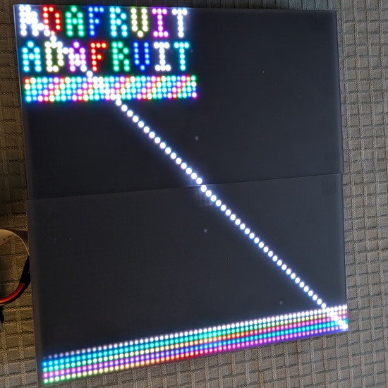](https://www.circuitpython.org/)

For now the code lives at [https://github.com/jepler/pi5-pio-protomatter](https://github.com/jepler/pi5-pio-protomatter).

**Scott**

This week I'm in Michigan visiting family. I'm working to get UART support going in the Zephyr version of the Nordic port. I want to prove out Zephyr as a future base for CircuitPython.

**Liz**

This week I worked on a guide for the [A4988 stepper motor driver](https://learn.adafruit.com/adafruit-a4988-stepper-motor-driver-breakout-board/overview). This breakout lets you control a stepper motor with just two pins; no library required. I found it to be really fun to use and look forward to using it in a project.

## Upcoming Events

The next MicroPython Meetup in Melbourne will be on January 22nd – [Meetup](https://www.meetup.com/micropython-meetup/events). You can see recordings of previous meetings on [YouTube](https://www.youtube.com/@MicroPythonOfficial). 

The community is coming back to Pittsburgh, Pennsylvania for PyCon US 2025 May 14 - May 22, 2025 - [us.pycon.org](https://us.pycon.org/2025/).

**Send Your Events In**

If you know of virtual events or upcoming events, please let us know via email to cpnews(at)adafruit(dot)com.

## Latest Releases

CircuitPython's stable release is [#.#.#](https://github.com/adafruit/circuitpython/releases/latest) and its unstable release is [#.#.#-##.#](https://github.com/adafruit/circuitpython/releases). New to CircuitPython? Start with our [Welcome to CircuitPython Guide](https://learn.adafruit.com/welcome-to-circuitpython).

[2024####](https://github.com/adafruit/Adafruit_CircuitPython_Bundle/releases/latest) is the latest Adafruit CircuitPython library bundle.

[2024####](https://github.com/adafruit/CircuitPython_Community_Bundle/releases/latest) is the latest CircuitPython Community library bundle.

[v#.#.#](https://micropython.org/download) is the latest MicroPython release. Documentation for it is [here](http://docs.micropython.org/en/latest/pyboard/).

[#.#.#](https://www.python.org/downloads/) is the latest Python release. The latest pre-release version is [#.#.#](https://www.python.org/download/pre-releases/).

[#,### Stars](https://github.com/adafruit/circuitpython/stargazers) Like CircuitPython? [Star it on GitHub!](https://github.com/adafruit/circuitpython)

## Call for Help -- Translating CircuitPython is now easier than ever

[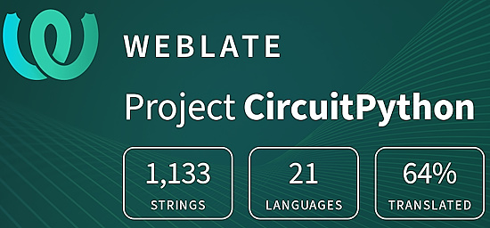](https://hosted.weblate.org/engage/circuitpython/)

One important feature of CircuitPython is translated control and error messages. With the help of fellow open source project [Weblate](https://weblate.org/), we're making it even easier to add or improve translations. 

Sign in with an existing account such as GitHub, Google or Facebook and start contributing through a simple web interface. No forks or pull requests needed! As always, if you run into trouble join us on [Discord](https://adafru.it/discord), we're here to help.

## NUMBER Thanks

The Adafruit Discord community, where we do all our CircuitPython development in the open, reached over NUMBER humans - thank you! Adafruit believes Discord offers a unique way for Python on hardware folks to connect. Join today at [https://adafru.it/discord](https://adafru.it/discord).

## ICYMI - In case you missed it

Python on hardware is the Adafruit Python video-newsletter-podcast! The news comes from the Python community, Discord, Adafruit communities and more and is broadcast on ASK an ENGINEER Wednesdays. The complete Python on Hardware weekly videocast [playlist is here](https://www.youtube.com/playlist?list=PLjF7R1fz_OOXRMjM7Sm0J2Xt6H81TdDev). The video podcast is on [iTunes](https://itunes.apple.com/us/podcast/python-on-hardware/id1451685192?mt=2), [YouTube](http://adafru.it/pohepisodes), [Instagram](https://www.instagram.com/adafruit/channel/)), and [XML](https://itunes.apple.com/us/podcast/python-on-hardware/id1451685192?mt=2).

[The weekly community chat on Adafruit Discord server CircuitPython channel - Audio / Podcast edition](https://itunes.apple.com/us/podcast/circuitpython-weekly-meeting/id1451685016) - Audio from the Discord chat space for CircuitPython, meetings are usually Mondays at 2pm ET, this is the audio version on [iTunes](https://itunes.apple.com/us/podcast/circuitpython-weekly-meeting/id1451685016), Pocket Casts, [Spotify](https://adafru.it/spotify), and [XML feed](https://adafruit-podcasts.s3.amazonaws.com/circuitpython_weekly_meeting/audio-podcast.xml).

## Contribute

The CircuitPython Weekly Newsletter is a CircuitPython community-run newsletter emailed every Monday. The complete [archives are here](https://www.adafruitdaily.com/category/circuitpython/). It highlights the latest CircuitPython related news from around the web including Python and MicroPython developments. To contribute, edit next week's draft [on GitHub](https://github.com/adafruit/circuitpython-weekly-newsletter/tree/gh-pages/_drafts) and [submit a pull request](https://help.github.com/articles/editing-files-in-your-repository/) with the changes. You may also tag your information on Twitter with #CircuitPython. 

Join the Adafruit [Discord](https://adafru.it/discord) or [post to the forum](https://forums.adafruit.com/viewforum.php?f=60) if you have questions.
